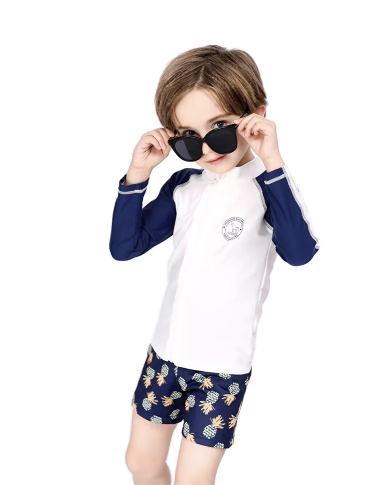

# Kids Swimwear Size Guide for Retailers: A Better Way to Help Families Find Fit

The swimsuit that looks right on a hanger can behave very differently in water. A loose neckline can shift; an over-snug sleeve can make a rash guard a battle to pull on; and a parent who guesses from age alone may return a perfectly good style for the wrong reason. For a retailer, those are not minor service issues. They are the moments that shape confidence in the whole collection.

A useful **kids swimwear size guide** does more than list ages. It gives families a simple way to choose a secure, comfortable fit before the first pool day—and gives store teams a consistent answer when customers ask, “Should I size up?”

## Start with measurements, then use age as a cross-check

Age labels are helpful shorthand, but children of the same age can have very different proportions. Encourage shoppers to begin with a soft tape measure and compare the result with the chart for the exact brand and style.

For MOMASONG styles, the [Size Guide & Fabric Care](https://momasong.com/size-guide) page lists height, chest, waist, and hip measurements from 2T through 14. The measurement order is deliberately practical:

- **Height:** from the top of the head to the floor, without shoes.
- **Chest:** around the fullest part of the chest, under the arms.
- **Waist:** around the narrowest part of the waist.
- **Hip:** around the fullest part of the hips.

Ask customers to keep the tape level and comfortably close to the body rather than pulling it tight. It is also worth recording the measurements in the product listing, order notes, or a fitting-card template. That small step is more useful than a generic “runs true to size” claim because it gives the shopper something they can check at home.

## A kids swimwear size guide should explain fit, not just numbers

Swimwear needs enough closeness to stay put in moving water, but it should not limit normal play. The best customer-facing guidance names both sides of that balance.

For a quick fitting check, parents can look for three signs:

1. **Secure coverage:** straps, waistbands, and rash-guard hems should sit in place without digging in.
2. **Easy movement:** the child should be able to raise both arms, squat, bend, and reach without discomfort.
3. **Stable wet use:** excess fabric can shift and bunch once wet, while a suit that is too tight may be uncomfortable for longer sessions.

This is especially useful in a **kids rash guard size guide**. Long sleeves add coverage, but they should still allow a child to reach, paddle, and play. A retailer can turn that detail into a strong product-page cue: “Check arm movement before removing tags.” It is specific, helpful, and more persuasive than a broad comfort promise.

## Handle between-size questions with a clear decision rule

“Size up” can be good advice, but it is not a substitute for fit. MOMASONG recommends choosing the next size when a child is between sizes for longer wear, while still checking that the suit fits securely. That distinction matters.

Give shoppers this simple rule: if measurements sit near the upper end of one range and the child needs room for growth, compare the next size; if the next size leaves visible gaps or causes straps and hems to move, the current size may be the better water fit. For a rash guard set, check the top and bottom together rather than assuming one piece tells the whole story.

Retailers can also reduce avoidable exchanges by adding two prompts near the size selector: “Measure before ordering” and “Use height plus body measurements, not age alone.” On a wholesale assortment, this same approach helps a buyer explain sizing with confidence across several styles.

## Connect fit advice to fabric and use case

Fit is not separate from product education. A family choosing a long-sleeve set for an outdoor beach day may value coverage and flexible movement; a family shopping for pool lessons may prioritize ease of movement and a stable fit. MOMASONG’s guide describes UPF 50+ protection, quick-dry fabric, chlorine resistance, and four-way stretch, alongside its fit chart. Those features give retail staff plain-language ways to connect the intended activity with the style.

Avoid turning that conversation into a list of unsupported performance promises. Instead, point customers to the product information and to MOMASONG’s [quality page](https://momasong.com/quality), which describes fabric inspection and production checks. Clear sourcing information makes a size recommendation feel considered rather than improvised.

## Build a size guide into every sales touchpoint

The best fit guidance is easy to find at the moment a customer needs it. Add a visible chart link on product pages, a compact “how to measure kids for swimwear” card in email or social content, and a staff script for common questions. If you sell in person, a printed measurement guide near the fitting area can turn uncertainty into a quick, useful conversation.

For private-label brands, sizing deserves attention during development as well. The [OEM/ODM process](https://momasong.com/oem-odm) includes sample development and size-range options, so bring target-customer measurements and fit expectations into the brief early. It is easier to make a clear size story when it is designed into the assortment rather than patched into product copy later.

## Frequently asked questions

### Should customers choose kids' swimwear by age?

Use age as a cross-check, not the only decision point. Height, chest, waist, and hip measurements give a more dependable starting point.

### What should a parent check when trying on a rash guard set?

Check that the child can lift their arms, bend, and move comfortably, and that the sleeves, hem, and waistband stay in place without pinching.

### What should retailers do when a child is between sizes?

Compare the chart and consider the next size for growth, then confirm the suit remains secure enough for water play. MOMASONG’s [size guide](https://momasong.com/size-guide) provides the relevant measurements and fit notes.

## Give customers confidence before the first splash

A strong **kids swimwear size guide** is one of the simplest tools a retailer can offer: it replaces guessing with a repeatable process, helps families focus on comfort and movement, and makes the collection easier to shop. Review the [MOMASONG shop](https://momasong.com/shop) alongside the size guide, or [contact the MOMASONG team](https://momasong.com/contact) to discuss fit information for your children’s swimwear assortment.
