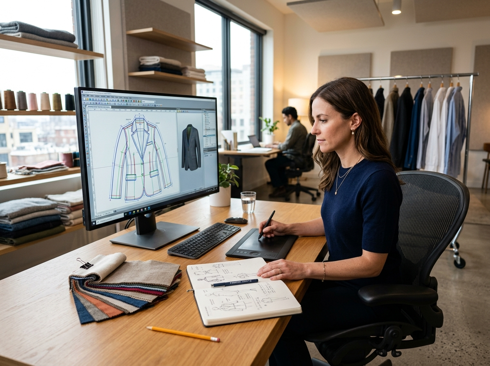
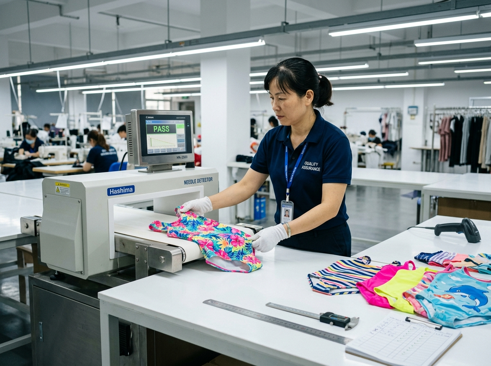

# How to Choose a Kids Swimwear Manufacturer: A Buyer’s Checklist

Choosing a **kids swimwear manufacturer** is not only a price comparison. The factory you choose will influence the fit of the collection, the accuracy of the colors, the consistency of repeat orders, and how confidently you can answer questions from retailers or parents.

For a new brand, the decision can feel difficult because every supplier promises quality and reliable delivery. A better approach is to compare manufacturers using the same practical checklist before requesting a final quote.

## 1. Check whether the factory understands children’s swimwear

Children’s swimwear has its own requirements. A manufacturer should be able to discuss size grading, comfortable elastics, lining, seam construction, coverage, and movement—not just fabric color and unit price.

Ask the supplier:

- Which age groups and size ranges do you produce regularly?
- Can you share examples of similar children’s styles?
- How do you check measurements between sample and bulk production?
- Can you adjust the fit for a brand’s own size chart?

A supplier may make many types of clothing, but that does not automatically mean it is the right children’s swimwear factory for your collection. Look for evidence of relevant experience in the actual product category.

*Design and development are the first stages to review when comparing a children’s swimwear manufacturer.*

## 2. Review the sample process before discussing bulk orders

A sample is not just a miniature version of the final product. It is the point where you discover whether the design works on a real child’s size range and whether the factory understands your instructions.

Before approving a supplier, clarify:

- What files or information are needed to begin?
- Can the factory work from sketches, reference samples, or a tech pack?
- How many revisions are included?
- Which measurements are checked during the fitting stage?
- What happens if the approved sample and bulk goods differ?

MOMASONG describes a process that moves from inquiry and quotation to sample development, bulk production, quality checks, and delivery. That sequence is useful for buyers because it makes responsibilities visible before the order becomes urgent. The [OEM/ODM page](https://momasong.com/oem-odm) explains the current workflow in more detail.

## 3. Ask for the exact fabric and performance specification

Terms such as quick-dry, chlorine resistant, recycled, and UPF 50+ are useful only when they are tied to a documented product specification. Do not assume that one fabric claim applies to every style in a supplier’s catalog.

Ask the manufacturer to confirm:

- Fiber composition and fabric weight
- Stretch and recovery expectations
- Lining and opacity
- Colorfastness and care instructions
- Whether UPF or other performance claims are tested for the approved fabric
- Which certificates or test reports are available for the order

MOMASONG’s [Size Guide & Fabric Care](https://momasong.com/size-guide) lists UPF 50+, quick-dry, chlorine-resistant, and four-way-stretch fabric features. Its [Quality page](https://momasong.com/quality) also describes material checks and production checkpoints. Use those pages as a starting point, then request the documentation that applies to your specific styles.

## 4. Look beyond certification logos for quality control

Certificates can be helpful, but they are only one part of supplier evaluation. You also need to understand what happens between fabric arrival and final packing.

Useful questions include:

- Is incoming fabric checked before cutting?
- Who checks measurements during sewing?
- How are print placement and color consistency reviewed?
- Are zippers, buttons, waistbands, and decorative details inspected?
- Is there a documented final inspection before shipment?

*A clear inspection process gives buyers something more useful than a general quality promise.*

If a supplier cannot explain its quality checkpoints in plain language, ask for more detail before placing a private-label order. You are not looking for a perfect-sounding answer; you are looking for a process your team can review and repeat.

## 5. Confirm MOQ, repeat orders, and production timing in writing

MOQ can change depending on the style, color, fabric, printing method, labels, and packaging. The number shown on a general website page may not be the final number for your specific order.

Before confirming a quote, ask for written answers to these questions:

1. What is the MOQ by style and color?
2. Can colors or sizes be mixed within an order?
3. What is the sample fee and approval process?
4. How long does sampling take?
5. When does the bulk lead time begin?
6. What documents are included before shipment?

Clear answers make a supplier easier to compare and help you plan a seasonal launch without relying on assumptions.

## 6. Test communication with a real brief

The first inquiry is also a communication test. Send a short but specific brief with the product type, target customer, size range, fabric preference, quantity, delivery window, labels, packaging, and destination market.

Then review the response. Does the supplier answer each question? Does it identify missing information? Does it flag a technical or timing risk before taking your deposit?

For a private-label brand, good communication is part of product quality. A factory that asks useful questions early is more likely to protect the details that matter later.

*A sample room should support practical review of fit, construction, and revisions before bulk production.*

## 7. Verify that the supplier can support your next stage

Your first order may be small, but your evaluation should include the next one. Ask whether the manufacturer can support new colors, additional sizes, custom labels, packaging, and repeat production if the collection performs well.

MOMASONG’s [About page](https://momasong.com/about) describes its experience working with global brands and retailers, while the [Contact page](https://momasong.com/contact) shows how buyers can start a conversation about product, sample, and wholesale requirements. The important point is to match the supplier’s actual capabilities with your growth plan.

## A good manufacturer makes the buying decision clearer

The right **kids swimwear supplier** will not remove every production decision, but it should make the important ones easier to manage. You should understand the sample process, fabric specification, quality checks, MOQ, timing, and communication before approving bulk production.

Use this checklist with two or three qualified manufacturers, compare the answers side by side, and keep the approved specification with your order records. To discuss children’s swimwear, private-label development, or OEM production, [contact MOMASONG](https://momasong.com/contact) with your product brief.

## Frequently asked questions

### What is the most important question to ask a kids swimwear manufacturer?

Ask how the factory controls the product from sample approval through bulk production. A clear answer should cover measurements, fabric, construction, inspection, and documentation.

### Should I choose the manufacturer with the lowest price?

Not automatically. Compare the total offer, including fabric, sampling, labels, packaging, quality control, lead time, communication, and the risk of costly corrections.

### What should a private-label buyer prepare before requesting a quote?

Prepare a sketch or tech pack, reference images, size range, quantity, color list, artwork, label requirements, packaging details, target delivery window, and destination market.

### How many manufacturers should I compare?

Two or three serious candidates are usually enough for a useful comparison. More important than the number is asking each supplier the same questions and checking the evidence behind the answers.
