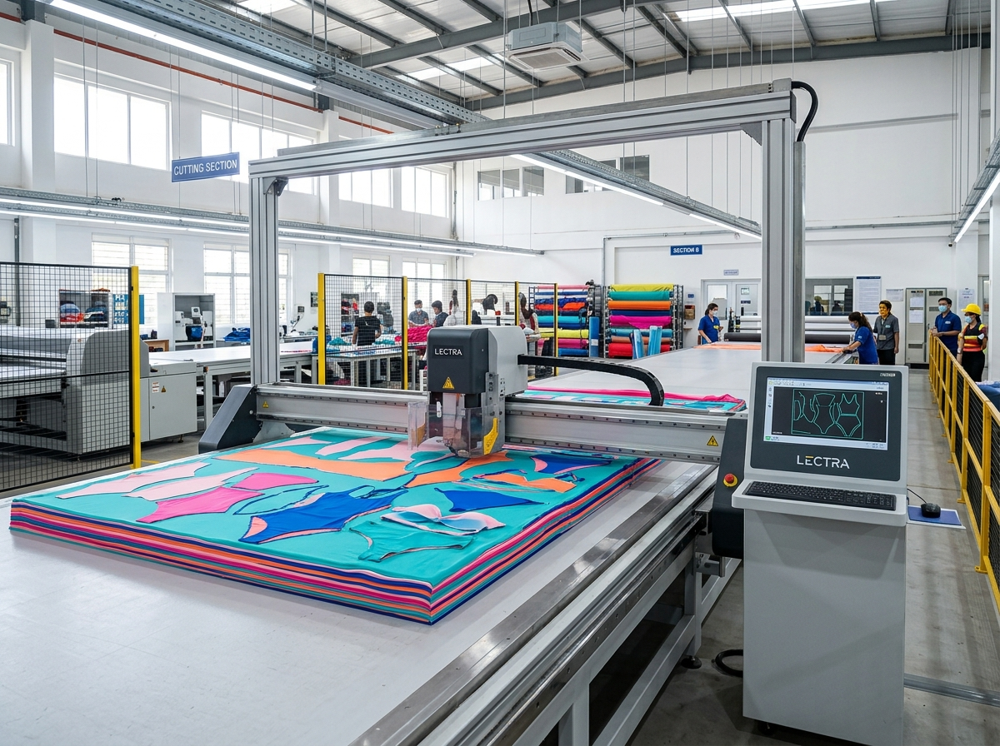

# Kids Swimwear Fabric Guide: How Retail Buyers Can Ask Better Questions

A print can win the first glance, but fabric decides whether a children’s swimwear range earns confidence after the first pool day. That is the quiet gap between a collection that looks complete online and one a shop team can explain without reaching for vague promises.

This **kids swimwear fabric guide** is for buyers building a range, not for chasing a single “best” material. Children swim in different conditions: weekly lessons, hotel pools, sandy holidays and long outdoor days. The useful job is to match the garment, its fit message and its care advice to those real routines.

## Begin with the use case, not a fabric buzzword

“Quick dry,” “stretch” and “UPF” are helpful terms only when they answer a customer's practical question. Before a buying appointment, divide the collection by the job each style needs to do.

- **Regular pool use:** Prioritize a secure, comfortable fit and clear rinse-and-care guidance for families returning to the water often.
- **Outdoor water play:** A long-sleeve rash-guard option gives parents a coverage choice. MOMASONG lists UPF 50+ rash-guard styles in its [shop](https://momasong.com/shop?category=rashguard).
- **Holiday or occasional swimming:** Parents may start with print and easy dressing, while still benefiting from a practical explanation of movement, care and fit.

That simple split prevents an assortment from treating every swimsuit as interchangeable. It also gives store teams a useful opening question: “Where will this be worn most?”

## What to look for in a kids swimwear fabric guide

For a retailer, fabric knowledge should turn into product language a parent can understand. MOMASONG’s [Size Guide & Fabric Care](https://momasong.com/size-guide) describes its swimwear as soft, breathable and durable for water play, and its FAQ states that its fabrics are OEKO-TEX Standard 100 certified. The same page describes chlorine-resistant, quick-dry, four-way-stretch fabric and gives garment-care instructions.

Those published points are useful starting facts, not permission to apply every claim to every future SKU. Confirm the approved specification for each style before adding copy to a product page, hangtag or retailer training sheet. A good fabric conversation keeps three things together:

### Comfort and movement

A child should be able to splash, reach and play without a suit feeling needlessly restrictive. Fit is part of fabric performance. MOMASONG’s guide advises a snug, secure fit with room to move and recommends using height and body measurements rather than age alone. Link shoppers to the [size guide](https://momasong.com/size-guide) so the fit message travels with the product.

### Coverage and sun-conscious shopping

Coverage is a design choice, not a substitute for a family's wider sun-safety routine. A buyer can offer standard swimsuits alongside rash guards so customers can select the silhouette that suits their activity. Keep the UPF language attached to the styles and approved claims that carry it; do not turn a category-level statement into a blanket promise.

### Care after the water

Care is where the fabric story becomes credible. MOMASONG advises rinsing in cold water after use, hand washing with mild detergent, avoiding bleach and softener, hanging garments to dry in the shade, and avoiding tumble drying, ironing and rough surfaces. Put that short routine near checkout, in product descriptions or on an insert. It is more helpful than a dramatic durability slogan.

## Turn quality questions into a private-label checklist

When a range is being developed, fabric should be discussed before the product description is written. MOMASONG’s [OEM/ODM page](https://momasong.com/oem-odm) outlines a workflow that includes design, sample development, production and quality control. Its [quality page](https://momasong.com/quality) describes incoming fabric inspection for colorfastness, weight and elasticity, plus in-line and final product checks.

Use the early conversation to record:

1. The intended activity for each style and the coverage it needs.
2. The exact fabric, construction and performance claims approved for the design.
3. How the size and fit guidance will be presented to customers.
4. The care steps that will appear on labels and selling materials.
5. Which claims need style-specific confirmation before launch.

This is a stronger brief than asking a factory for “premium fabric.” It makes room for the development team to clarify what is known, what needs testing or approval, and what should never be implied. For private-label buyers, that discipline also prevents a beautiful sample from becoming a confusing retail story later.

## Merchandise the explanation, not just the garment

The best product page does not overload a parent with textile terms. It answers the next decision: Is this suitable for lessons, outdoor play or a holiday? How should it fit? What happens after swimming? A compact “fit, activity, care” panel can make the answer feel immediate.

The same approach works in person. Place rash guards near the styles they complement, use the [shop](https://momasong.com/shop) categories to structure online navigation, and teach staff to connect coverage and care to the customer’s routine. The goal is not to claim that one material solves every problem. It is to make the choice feel considered.

## Frequently asked questions

### Does chlorine-resistant kids swimwear mean it will never fade or stretch?

No. Avoid absolute promises. Explain the intended use, confirm the approved style-level claims and give the customer practical after-swim care guidance.

### Should a retailer use the same fabric copy for every swimsuit?

No. Use only details approved for that style. Category guidance can inform the conversation, but accurate SKU-level information is more trustworthy.

### What should a private-label brand confirm first?

Confirm the intended activity, coverage, fabric and construction details, fit guidance, care copy and any claims planned for the final product page.

## Make fabric a clearer buying decision

The value of a **kids swimwear fabric guide** is not a longer specification sheet. It is a range that connects a child’s real water routine to fit, coverage and care without overpromising. To discuss a retailer or private-label collection with those decisions in view, [contact MOMASONG](https://momasong.com/contact) and bring the questions your customers will ask first.
