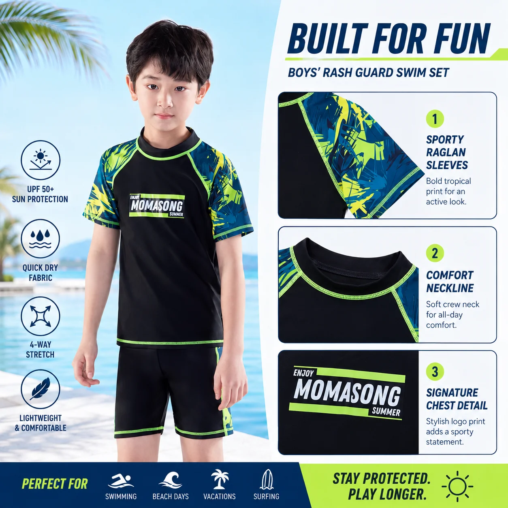

# Family Beach Vacation Swimwear: A Retailer’s Edit for Easier Packing

The beach bag is usually where a family holiday starts to unravel. A parent has remembered towels and snacks, but their child’s swim top is still damp from yesterday, the hat has disappeared, and the spare outfit is at the bottom of a suitcase. For retailers, that small chaos is useful insight: **family beach vacation swimwear** sells best when it solves a whole day, not just a single swim.

The strongest vacation assortment helps a parent move from breakfast to sand, water, shade and the ride home with fewer last-minute decisions. Here is a practical way to merchandise that story.

## Start with a swim piece built for the longest part of the day

For a quick pool session, almost any comfortable suit can work. A beach day is different: children may be in and out of water, playing on the sand and walking between shade and sun. That is why a beach-focused edit should lead with coverage, movement and easy changes rather than a long list of separate fashion pieces.

A [kids rash guard set](https://momasong.com/shop) gives retailers an easy hero category. Parents can immediately understand the top-and-bottom combination, while stores can show the set alongside a second dry layer or accessory. MOMASONG’s live size guide describes long-sleeve rash guard sets as an option for outdoor beaches and identifies its swimwear fabric as quick-dry with four-way stretch. Those are shopper-friendly benefits to explain plainly: more coverage for outdoor play, fabric intended to dry quickly, and room to bend, paddle and build.

The key is not to treat a rash guard as the entire answer. Sun-protective clothing is one part of a sensible beach routine, alongside shade, sunscreen and adult supervision around water. That honest framing builds more trust than promising a single garment can handle every condition.

## Build family beach vacation swimwear as a three-piece solution

Retail displays become easier to shop when the customer can see a complete use case. Instead of placing all swim styles together, create a compact “beach-ready” story around three jobs.

### 1. The water layer

Offer a rash guard set, one-piece or two-piece swim set as the starting point. Let the child’s activity guide the choice: a more covered rash guard option for long outdoor stretches, or a flexible suit for a shorter, water-first outing. The [MOMASONG shop](https://momasong.com/shop) lists rash guards, one-piece swimsuits and two-piece sets across children’s age groups, giving buyers several ways to create that first layer.

### 2. The shade and surface layer

Add the small items parents notice only when they are missing. A wide-brim hat can support a shade-minded beach setup, while water shoes can be useful for walking between sand, boardwalk and poolside. These are not decorative add-ons: they turn a swimsuit purchase into a more complete packing plan. MOMASONG’s shop groups these supporting items under [swim accessories](https://momasong.com/shop), which makes a natural internal link for a “finish the bag” display online or in store.

### 3. The dry-home layer

The last useful piece is one designed for the transition out of the water. A hooded towel poncho or a dry change of clothes gives parents a clear reason to add another item before checkout. It also changes how the collection feels: not swimwear for a photo, but a system for a real family day.

## Make fit advice part of the vacation story

Parents shopping for the best kids swimwear for the beach are often buying ahead of a trip. That makes fit guidance a conversion tool, not a footer link. A clear age-and-measurement reference helps the shopper choose with more confidence, especially when they are ordering for several children or planning in advance.

Link directly to the [MOMASONG size guide](https://momasong.com/size-guide) from product pages and beach packing content. The guide provides height, chest, waist and hip measurements by size, and advises choosing the next size up when a child is between sizes for longer wear. Retailers can turn that into a useful reminder: measure before packing, try the suit before travel day, and make sure the child can move comfortably.

This is also where an assortment earns loyalty. A clear explanation of what a parent should check—coverage, secure fit, freedom to move and a practical change plan—feels more valuable than another generic “summer must-haves” list.

## Merchandise the moment, not just the product

The distinct opportunity in family beach vacation swimwear is the before-and-after picture. Before: a parent is assembling a bag from memory. After: they can choose a coordinated water layer, accessory and dry-home piece in one visit.

For retailers and private-label teams, try a simple content sequence: lead with a beach-day checklist, show one outfit combination, then point to sizing and care. If developing a branded collection, the [OEM/ODM page](https://momasong.com/oem-odm) is the appropriate starting point to discuss custom swimwear options rather than making assumptions about specifications or timelines.

## Frequently asked questions

### What should a child wear for a long beach day?

Start with swimwear that fits securely and allows movement, then add a hat, water-ready footwear where useful, sunscreen, shade and a dry layer for the journey home. Choose the level of coverage according to the family’s plans and local conditions.

### Is a rash guard set only for swimming?

No. It can be a practical option for outdoor water play because it pairs a swim top with bottoms. Check the fit before travel and follow the brand’s care guidance after use.

### How can a retailer make beachwear easier to shop?

Group one swim piece, one accessory and one dry-home item together, then add a visible size-guide link. It gives parents a ready-made solution instead of a rack of disconnected items.

## Create a beach edit parents can use

The best **family beach vacation swimwear** presentation does not ask parents to become experts. It helps them leave with a simple, useful plan for a long day near water. Explore MOMASONG’s [kids’ swimwear collection](https://momasong.com/shop), or [contact the team](https://momasong.com/contact) to discuss a retailer or private-label beach assortment.
