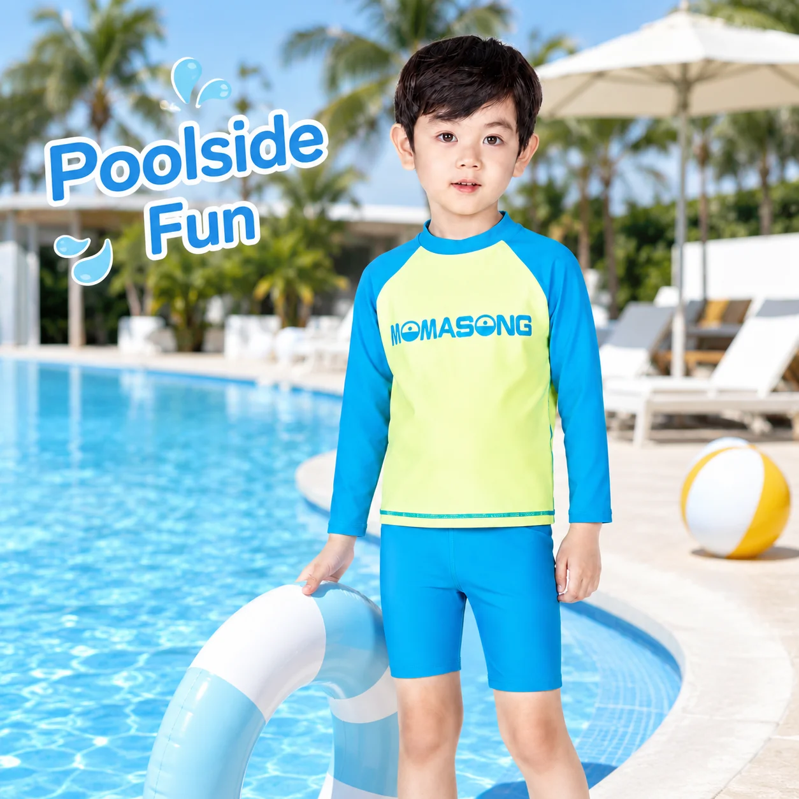

# Kids Rash Guard Set: A Beach-Day Retailer’s Guide to the Easy Yes

A family’s beach day is full of small friction points: a child is ready for the water before a parent has found the sunscreen, a wet suit needs changing, and the sand is already hot. A coordinated **kids rash guard set** gives shoppers a clear answer for an active day near water—and retailers an easy story to tell in store, online, and in a seasonal email.

The opportunity is not to sell “more pieces.” It is to merchandise a ready-for-the-beach solution. When a top and bottom look intentionally paired, parents spend less time matching and more time choosing the coverage, fit, and print that suit their child.

## Why a kids rash guard set earns its place in a beach edit

Beach customers are thinking about a windy shoreline, a snack break, and a child who wants to go straight back into the water. That context makes a set easier to understand than disconnected swim separates.

MOMASONG’s shop currently groups **Rash Guards**, **Two-Piece Sets**, and **Swim Accessories**, which is a useful foundation for a beach-day edit. A retailer can build around one hero set, then offer the practical add-ons that finish the trip: a sun hat, water shoes, or a towel poncho. The set remains the decision-maker; accessories make the display feel complete rather than crowded.

### Lead with the day, not a technical checklist

“Beach-day ready” is stronger merchandising language than a dense list of features. Put a coordinated set beside a short message about active water play, then let the product page answer the practical questions. The live MOMASONG [size guide](https://momasong.com/size-guide) is especially helpful here: it advises a snug, secure fit for water and room to move, and suggests sizing up when a child is between sizes for longer wear.

It also gives store teams a consistent conversation starter: Who is this for, and where will they wear it?

## Build coverage choices into the assortment

One set cannot serve every family or climate. Make the coverage decision visible: long-sleeve options can lead for outdoor beach days, while short-sleeve sets can sit beside them as a lighter alternative.

Place a long-sleeve set in a “long beach day” story with a hat and towel poncho. Use a short-sleeve or two-piece swim set in a “pool and play” story. This turns a crowded swim wall into a choice shoppers can navigate quickly.

MOMASONG describes UPF 50+ sun protection and quick-dry fabric across its site. Those are useful reasons to explore the range, but retailers should keep product claims aligned with the exact style and its current specification. In customer-facing copy, plain language wins: highlight the amount of coverage, how the set supports movement, and which activity it suits.

## Make fit reassurance part of the display

Fit anxiety can stop an otherwise easy purchase. Link from each online set to the [MOMASONG size guide](https://momasong.com/size-guide), and give in-store staff a simple measurement prompt. The guide covers height, chest, waist, and hip measurements.

Add a concise note near the set: “Check height first; if between sizes, review the guide.” It is specific without overpromising and encourages a more confident selection than relying on age alone.

## Pair prints with a reason to return

Print is often the emotional hook, but it should have a job beyond decoration. Ocean, surfboard, floral, or bright graphic themes can help a child spot a favorite; a coordinated top-and-short set makes that preference immediately wearable. Keep hero prints focused, then carry one or two into accessories or a complementary swimsuit.

For private-label brands, this is also where a beach-day narrative becomes a range brief. MOMASONG’s [OEM/ODM page](https://momasong.com/oem-odm) describes a process that begins with ideas, sketches, or tech packs and includes fit-sample review before production. Use that early design conversation to define the activity, coverage direction, and print family—not merely a logo placement.

## A simple beach-day merchandising formula

Try a three-part display or landing-page module:

1. **Choose a set:** show long- and short-sleeve options together, with clear activity cues.
2. **Check the fit:** make the size guide one click or one sign away.
3. **Finish the day:** add a practical accessory, such as a hat, water shoe, or towel poncho.

This formula respects how families actually shop. It also keeps the retailer’s message useful: the collection is not asking parents to buy a look; it is helping them prepare for a day that moves between sun, sand, snacks, and water.

## Frequently asked questions

### What should retailers highlight in a kids rash guard set?

Start with the intended activity, visible coverage, comfortable movement, and a clear route to size guidance. Confirm any fabric or UPF statement against the specific product before publishing it.

### How can a retailer make a swimwear display easier to shop?

Group coordinated sets by beach-day use, put fit information close to the product, and add only accessories that solve a nearby need. A focused edit is easier to understand than a large mixed display.

### Are rash guard sets only for the beach?

No. They can also suit pool time and other water play. The best recommendation depends on the child’s activity, preferred coverage, and the product’s stated specification.

## Bring the beach-day edit to life

A great **kids rash guard set** is an easy yes because it answers a real family question: “What will make this water day simpler?” Explore MOMASONG’s [shop collection](https://momasong.com/shop), review fit support in the [size guide](https://momasong.com/size-guide), and [contact the MOMASONG team](https://momasong.com/contact) to discuss a focused beach-season range or private-label concept.
