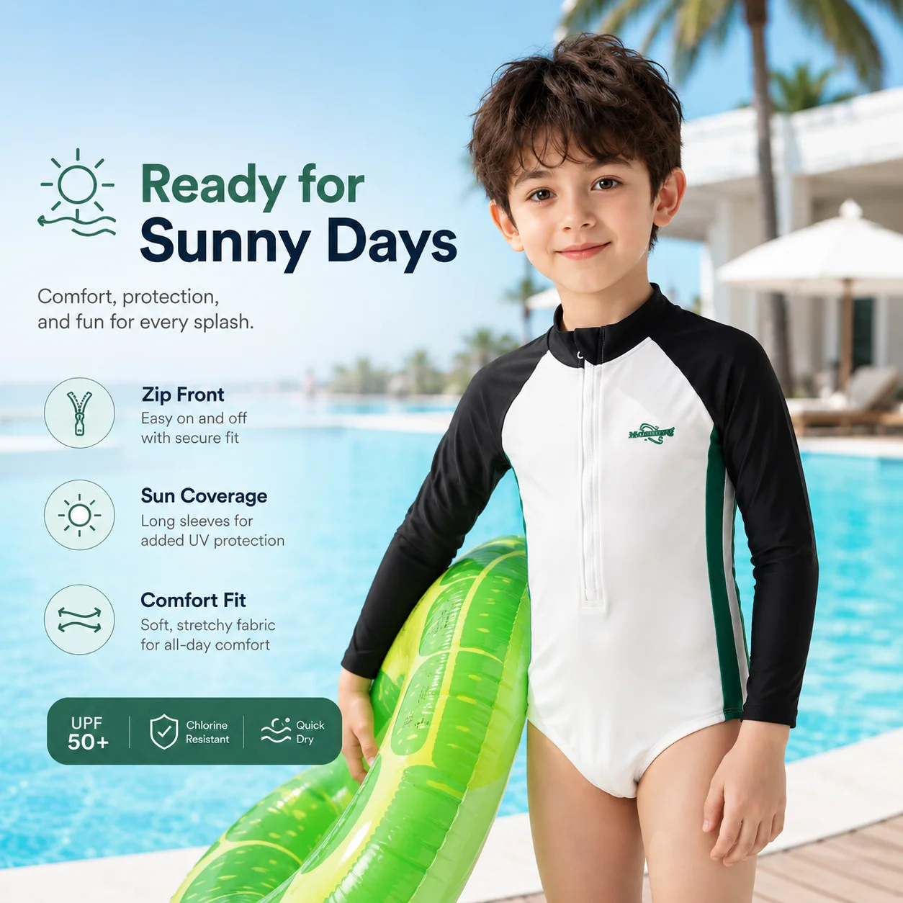

# How to Build a Beach-Ready Kids Swimwear Collection for Retailers

The strongest summer swimwear collections are not built by ordering one of everything. They are built around the way families actually spend a day near the water: swimming, drying off, grabbing lunch, going back in, and trying to keep sand out of everything along the way.

That creates a practical merchandising question: how can a **wholesale kids swimwear** assortment cover the main needs of a beach day without becoming a crowded rack of disconnected products? For buyers building a **kids swimwear wholesale** program, a tighter edit is usually more useful than a larger one.

Start with the job each product needs to do, then build around coverage, easy outfit building, and a clear buying story.

## Start with the beach day, not the SKU list

Before choosing colors or prints, map the moments your customer is buying for.

- **Active swimming:** Customers need secure, comfortable swimwear that stays in place during movement.
- **Long outdoor exposure:** Rash guards, swim dresses, and wider coverage options can support a more sun-conscious assortment.
- **Between-water transitions:** A hooded poncho, towel, or quick-dry layer makes the walk from the water to the car easier.
- **Accessories and finishing pieces:** Hats and water shoes help a collection feel complete rather than limited to swimsuits.

## Build the wholesale kids swimwear collection around three product jobs

### 1. Core swimwear for movement

Start with the styles that carry the collection: one-piece swimsuits, two-piece sets, swim dresses, and rash guard sets. Offer a mix of coverage levels and silhouettes, but keep the assortment understandable.

For younger children, one-piece rash guard styles can provide a secure, easy-to-wear option. A focused **kids rash guard wholesale** line can then cover long-sleeve and short-sleeve needs without overwhelming the assortment. Two-piece sets can be useful for older children who want more independence, while swim dresses add a more fashion-led choice for girls’ collections.

MOMASONG’s [wholesale shop](https://momasong.com/shop) groups girls’ swimwear, boys’ swimwear, rash guards, one-piece styles, two-piece sets, and accessories, giving buyers a practical starting point for building this core layer.

### 2. Easy layers for the walk between water and sand

The product that solves the in-between moment can be just as useful as the swimsuit itself. A hooded beach towel poncho gives children a quick layer after swimming without asking parents to manage a full change of clothes on the beach.

*MOMASONG Kids Hooded Beach Towel Poncho – Sea Shell. Product details: [view product](https://momasong.com/products/lw-sw32.html).*

It can sit beside swimwear by collection, color story, or beach-day use rather than being hidden in a separate accessories section.

### 3. Accessories that complete the beach-day edit

A wide-brim sun hat or pair of quick-dry water shoes can make a swimwear edit feel more complete. These products are not substitutes for swimwear; they help a retailer build a more useful water-play story.

*MOMASONG Kids Wide Brim UV Sun Hat – Sea Shell. Product details: [view product](https://momasong.com/products/lw-sw47.html).*

Keep the accessory range focused. A few useful, coordinated pieces are easier to merchandise and replenish than a large selection with no clear relationship to the main collection.

## Use coverage and fabric benefits as buying filters

Wholesale buyers need more than attractive prints when comparing suppliers. Product information should help them decide which styles belong in which part of the range.

Useful filters include:

- UPF 50+ protection where supported by the approved product specification
- Quick-dry performance
- Chlorine resistance for pool-focused styles
- Four-way stretch for active movement
- Recycled or certified fabric options where documented
- Easy-care instructions for parents and retailers

MOMASONG’s [Size Guide & Fabric Care](https://momasong.com/size-guide) describes UPF 50+, quick-dry, chlorine-resistant, and four-way-stretch fabric features. The [Quality page](https://momasong.com/quality) provides additional context on materials, testing, and production checks. Buyers should still confirm the approved specification for each style before using a claim on a product page or retail label.

## Plan sizes as a collection, not one product at a time

An attractive print will not sell well if the size run does not match the store’s customers. Review age groups and body measurements before finalizing quantities, then compare the size curve across the range.

The same color story across a girls’ rash guard, a boys’ set, and an accessory can also make sibling shopping easier and give the buyer a clearer merchandising plan.

Use the [MOMASONG size guide](https://momasong.com/size-guide) as a reference point, but confirm the measurement chart and grading for every custom style before production.

## Keep wholesale planning focused and testable

A beach-ready collection does not need to launch with every possible style. A focused first order can test three things:

1. Which silhouettes receive the most attention?
2. Which size groups turn over fastest?
3. Which accessories increase the value of a swimwear purchase?

Discuss the final MOQ, color options, sample process, and production timing with the factory before confirming the assortment. MOMASONG’s [OEM/ODM process](https://momasong.com/oem-odm) covers design, sample development, bulk production, quality checks, and delivery as connected steps rather than separate transactions.

## Make the collection easy to buy and easy to explain

The best wholesale presentation gives the retailer a simple story to repeat: core swimwear for the water, coverage options for long outdoor days, and practical layers and accessories for everything around the swim.

That story helps buyers compare products, helps sales teams guide customers, and gives a private-label brand a stronger foundation for its seasonal collection. For help developing a focused **kids swimwear wholesale** assortment, [contact MOMASONG](https://momasong.com/contact) to discuss products, samples, and customization options.

## Frequently asked questions

### What should a beach-ready kids swimwear collection include?

Start with core one-piece, two-piece, and rash guard styles, then add a small group of useful accessories such as hats, water shoes, and towel ponchos.

### Are accessories important for wholesale kids swimwear buyers?

Yes. Carefully selected accessories can complete the beach-day assortment and create natural cross-selling opportunities, especially when colors or prints coordinate with the main swimwear range.

### How should retailers choose the first order?

Begin with a focused assortment across the most relevant age groups and coverage levels. Confirm the final MOQ, size grading, color options, sample approval process, and production timing with the supplier before placing the order.

### Should every style use the same fabric claim?

No. Use UPF, chlorine-resistance, recycled-content, or other performance claims only when they are supported by the approved specification for that particular style.
