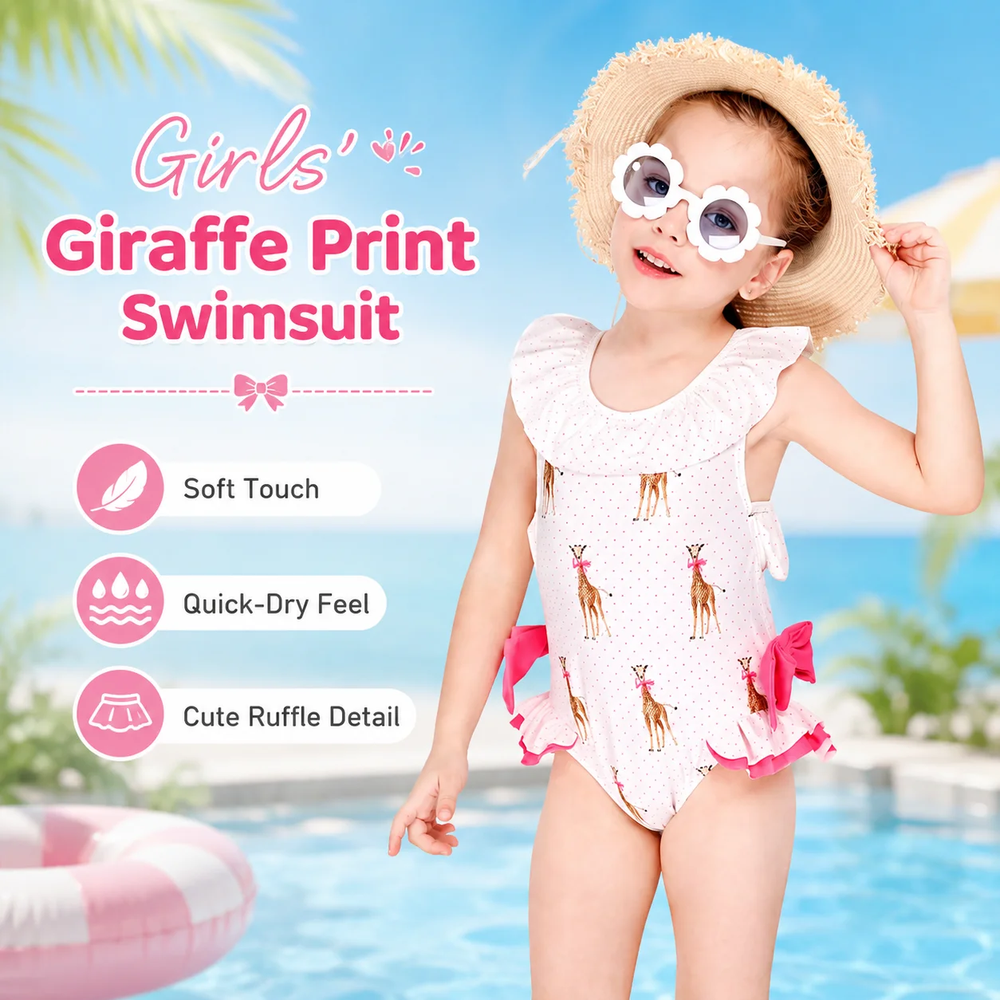
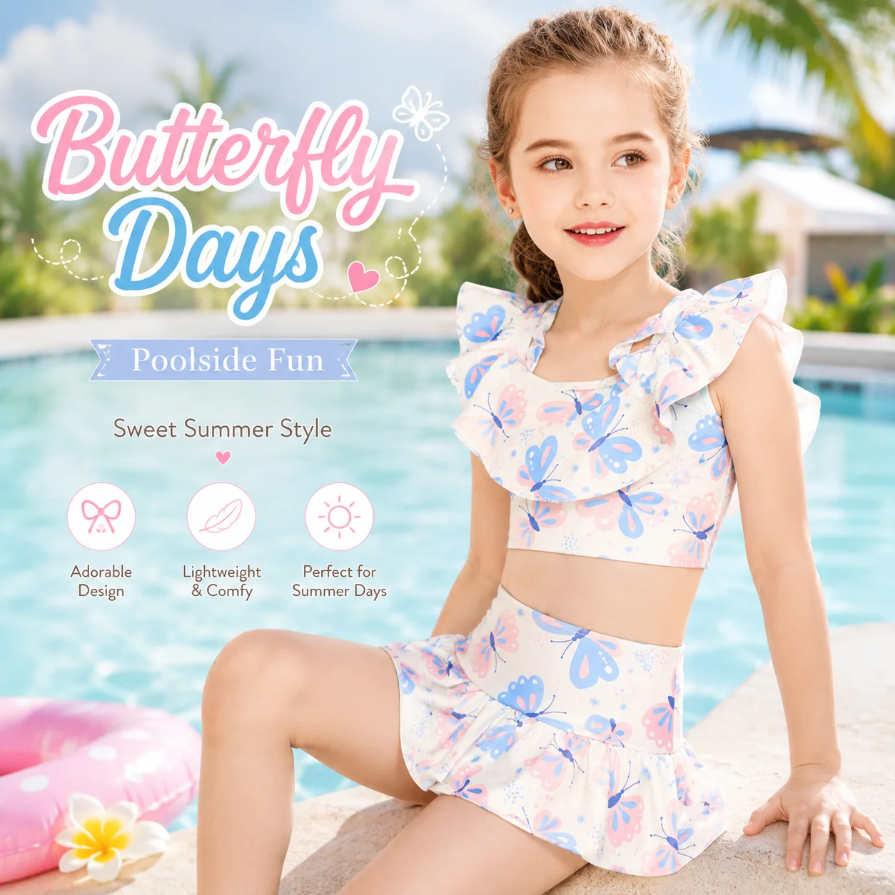

# Kids Swim Accessories: How Retailers Can Build a Complete Beach-Day Edit

Swimwear is the obvious starting point for a summer collection, but it is not the whole beach-day experience. Children still need to walk across hot sand, wait between swims, dry off, and get back into the car without turning every transition into a clothing change.

That is where **kids swim accessories** earn their place. For a retailer, the right accessories do more than fill a shelf: they solve small problems, make a swimwear range easier to shop, and give customers a natural reason to build a more complete outfit.

## Start with the moments around the swim

Before choosing accessory styles, think through the customer’s day:

- **Getting to the water:** Children may need footwear for hot sand, rough paths, or slippery pool areas.
- **Playing outside:** A sun hat can complement swimwear during breaks and travel between activities.
- **Leaving the water:** A towel poncho or cover-up gives children a quick warm layer without a full change of clothes.
- **Packing for the day:** Compact, useful accessories can make a family’s beach bag easier to organize.

This gives buyers a better framework than choosing accessories only because they match a print. The product should have a clear job first; the color story comes next.

## 1. Water shoes: a practical add-on for active families

Water shoes are one of the easiest accessories to connect with children’s swimwear. They make sense for beaches, splash parks, pool decks, and outdoor water play, so the use case is easy for staff to explain.

When reviewing a **kids water shoes wholesale** range, look at more than the upper design. Buyers should confirm the available sizes, closure or slip-on construction, sole details, material information, and care instructions. The product needs to be comfortable enough for movement and simple enough for families to use regularly.

*MOMASONG Kids Quick-Dry Water Shoes – Jungle Leaf. [View the product](https://momasong.com/products/lw-sw16.html).*

On a retail floor, water shoes can sit next to boys’ and girls’ swimwear rather than in an unrelated footwear section. That placement helps shoppers see the accessory as part of the same day at the water.

## 2. Towel ponchos: the easiest transition layer

A **kids beach towel poncho** solves a very specific moment: the child is out of the water, but the family is not ready to leave the beach or pool area. It provides coverage, warmth, and a simple way to dry off without requiring a changing room.

For retailers, that makes the poncho useful in several ways. It can be merchandised as an add-on to a swimsuit, included in a holiday edit, or presented as a practical gift item for families who already have enough swimwear.

*MOMASONG Kids Hooded Beach Towel Poncho – Sea Shell. [View the product](https://momasong.com/products/lw-sw32.html).*

Check the product dimensions, fabric feel, hood construction, care instructions, and available colors before adding it to a seasonal order. A useful transition product should be easy to understand from one product photo and a short description.

## 3. Sun hats: a small product with a clear role

Sun hats are a natural fit for a beach, resort, or outdoor-play collection. They can sit beside rash guards and swim dresses, giving buyers a simple way to build a broader sun-conscious assortment.

When comparing **kids sun hat wholesale** options, confirm the size range, brim shape, material, color options, and whether the product has a documented UV-related specification. Use only the claims supported by the approved product information.

*MOMASONG Kids Wide Brim UV Sun Hat – Sea Shell. [View the product](https://momasong.com/products/lw-sw47.html).*

Matching a hat to a swimwear print can make the collection feel intentional, but matching is not essential. A small selection of easy-to-coordinate colors may be more useful than a different hat for every swimsuit.

## Build accessories into the collection architecture

Accessories work best when they are connected to the main range in a visible way. A buyer might organize the collection by:

- **Beach day:** Rash guard, water shoes, hat, and towel poncho
- **Pool lessons:** One-piece or two-piece swimwear, quick-dry layer, and practical footwear
- **Holiday packing:** Two or three core swimwear styles plus compact accessories
- **Sibling shopping:** Coordinated colors or related prints across boys’ and girls’ products

MOMASONG’s [wholesale shop](https://momasong.com/shop) includes girls’ swimwear, boys’ swimwear, rash guards, one-piece styles, two-piece sets, and swim accessories. That wider category structure can help buyers review the range as a collection instead of ordering each product in isolation.

## Use product information to support cross-selling

A customer is more likely to add an accessory when the product page answers the practical questions quickly. Each item should explain:

- What moment it is designed for
- Which age or size range is available
- How it fits with the swimwear collection
- What material and care information applies
- Whether colors or prints coordinate with other styles

Keep the language specific. For example, “a quick layer after swimming” is more useful than “the perfect summer essential.” Clear copy helps both customers and store staff make the connection.

## Confirm the details before placing a wholesale order

Before approving a **kids swim accessories wholesale** order, confirm the final MOQ, size breakdown, color availability, sample process, packaging, care labels, and production timing. These details may vary by product and should be included in the final quotation rather than assumed from a general catalog.

For private-label collections, also confirm whether the supplier can coordinate accessory packaging and labels with the main swimwear order. MOMASONG’s [OEM/ODM process](https://momasong.com/oem-odm) covers customization, sample development, production, quality checks, and delivery as one connected workflow.

## A useful accessory range is small, clear, and easy to reorder

Retailers do not need a huge accessories department to make a swimwear collection feel complete. A focused edit of water shoes, towel ponchos, and sun hats can cover the main moments around swimming without creating unnecessary inventory risk.

The strongest range is easy to explain: products that help children get to the water, enjoy the day, and leave comfortably. To discuss **wholesale kids swimwear**, accessories, or private-label options, [contact MOMASONG](https://momasong.com/contact) with your collection brief.

## Frequently asked questions

### Which kids swim accessories should a retailer stock first?

Start with products that solve common beach and pool problems: water shoes, towel ponchos, and sun hats. Add more styles after you understand which sizes and use cases your customers prefer.

### Should accessories match the swimwear prints?

Matching prints can create a stronger collection story, but a focused color palette may be easier to reorder and merchandise across multiple swimwear styles.

### What should buyers confirm with an accessories supplier?

Confirm materials, sizes, care instructions, packaging, MOQ, color availability, sample approval, and the documented claims for each product.

### Can accessories be included in a private-label order?

Often, yes, depending on the supplier and product. Ask whether labels, packaging, and color coordination can be handled alongside the main swimwear collection.
