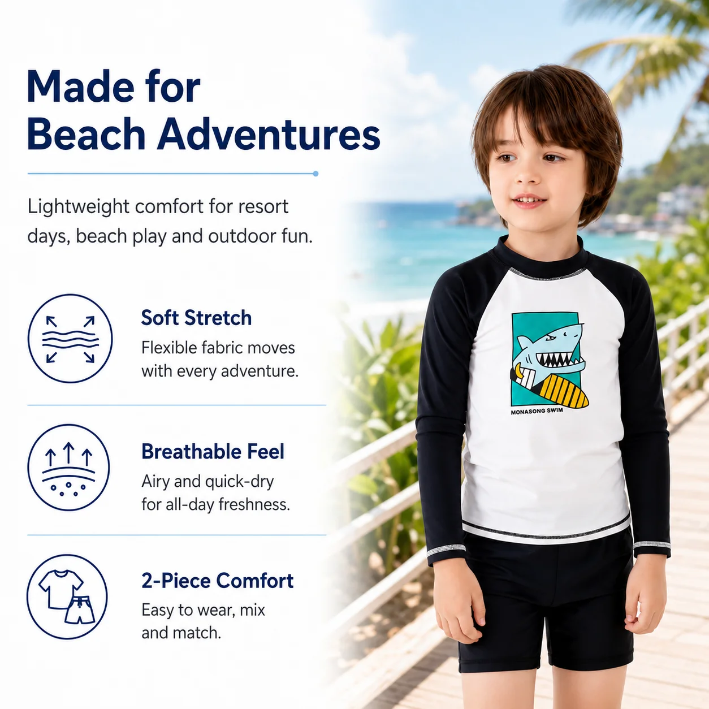
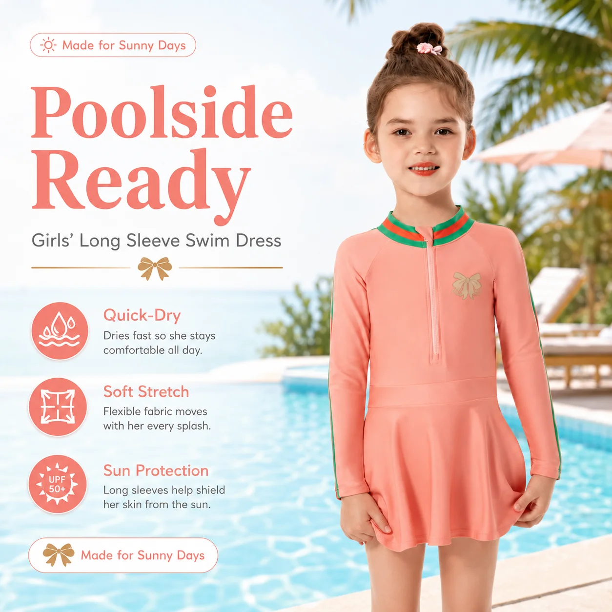

# Kids Swimwear Trends 2027: Colors, Prints and Coverage Retailers Can Plan Around

Trend planning is useful when it helps a buyer make a better order. It becomes less useful when it turns into a list of vague predictions that cannot be translated into colors, sizes, and products.

When planning around **kids swimwear trends 2027**, retailers can start with four practical signals: the mood of the color story, the role of prints, the amount of coverage, and the depth of the assortment. Together, these signals create a collection that feels current without forcing a buyer to overcommit to one short-lived look.

## 1. Build a color story before choosing individual prints

A seasonal collection feels more intentional when the colors work together. That does not mean every product needs to match. It means a buyer can place several styles on the same rail, product page, or campaign and have them feel like part of one collection.

Useful color planning questions include:

- Which colors will carry the core collection?
- Which shades can work across girls’ and boys’ styles?
- Can the same accent color appear in swimwear and accessories?
- Which colors are easy to photograph and describe online?

Start with a small base palette, then add one or two stronger accents. This gives the collection visual energy while keeping future reorders easier to manage.

*MOMASONG Girls Premium Swim Dress – Mermaid Magic. [View the product](https://momasong.com/products/lw-sw21.html).*

## 2. Use prints to create product personality

Prints are often the first thing a child notices, but buyers still need to consider where each print belongs in the range. A playful ocean motif may work as a hero style, while a quieter pattern can support repeat purchases and sibling shopping.

For a **wholesale kids swimwear** collection, consider three print roles:

- **Hero prints:** Strong, memorable designs used to attract attention.
- **Core prints:** Easy-to-wear patterns that can carry more size depth.
- **Quiet coordinates:** Simpler colors or small-scale designs that balance the display.

MOMASONG’s current collection includes themes such as mermaids, sharks, coral reefs, tropical waves, and ocean-inspired prints. Those themes can be organized into a clear visual story instead of being presented as unrelated artwork.

*MOMASONG Boys Shark Print Rash Guard Set – Coral Reef. [View the product](https://momasong.com/products/lw-sw07.html).*

## 3. Treat coverage as part of the trend plan

Coverage is not only a technical feature. It also shapes the look and use of the collection. Long-sleeve rash guard sets, one-piece suits, swim dresses, and two-piece styles give retailers different ways to respond to customers who want choice.

For 2027 planning, avoid treating coverage as an either-or decision. A balanced range can include:

- Long-sleeve rash guard sets for outdoor and active use
- One-piece styles for secure, simple dressing
- Two-piece sets for flexibility and easier changing
- Swim dresses for a more fashion-led girls’ assortment
- Accessories that support the beach or pool day

MOMASONG’s [Shop page](https://momasong.com/shop) separates girls’ swimwear, boys’ swimwear, rash guards, one-piece styles, two-piece sets, and accessories. That structure can help buyers compare coverage and product roles before finalizing quantities.

## 4. Keep girls’ and boys’ collections connected without making them identical

Retailers often need boys’ and girls’ products to feel related, especially when families shop for siblings. The connection can come from a shared color, ocean theme, trim detail, or photography style rather than an identical print.

For girls’ swimwear wholesale, a buyer might combine a swim dress, ruffle two-piece, and rash guard set. For boys’ swimwear wholesale, the matching story could use a rash guard set, two-piece swim set, and swim shorts in related colors.

*MOMASONG Girls Ruffle Two-Piece Swimsuit – Coral Reef. [View the product](https://momasong.com/products/lw-sw22.html).*

The goal is not to make every product look the same. It is to give the customer an easy way to see the collection as a whole.

## 5. Pair visual trends with proven product functions

A strong print cannot compensate for a confusing product description or an unsuitable fit. While planning colors and graphics, keep the practical product information visible:

- UPF 50+ protection where supported by the approved specification
- Quick-dry performance
- Chlorine resistance for pool-focused styles
- Four-way stretch
- Size and measurement guidance
- Care instructions

MOMASONG’s [Size Guide & Fabric Care](https://momasong.com/size-guide) describes these fabric features and gives measurement guidance. Its [Quality page](https://momasong.com/quality) provides additional information about materials and production checks. Buyers should confirm the exact claims and specifications for each SKU before publishing them in retail copy.

## 6. Plan product depth more carefully than product count

One of the easiest mistakes in trend buying is ordering too many different styles and too few units in the styles customers actually want. A more controlled approach is to decide which products deserve depth.

Give deeper size and color coverage to the styles that:

- Fit the main customer age groups
- Work across more than one activity
- Can be reordered in a related color or print
- Have a clear place in the collection story

Use more experimental prints as smaller tests. This gives a retailer room to learn without making the entire season dependent on one trend call.

## Turn trend ideas into a useful 2027 brief

A good buying brief should be specific enough for a supplier to quote. Include the target customer, product categories, size range, color palette, print direction, coverage requirements, fabric preferences, labels, packaging, quantity, and delivery window.

MOMASONG’s [OEM/ODM process](https://momasong.com/oem-odm) covers design, sample development, customization, production, quality checks, and delivery. For a private-label collection, discussing those details early gives the trend direction a better chance of surviving the move from mood board to finished product.

## The best kids swimwear trends are easy to buy and easy to wear

The most useful **kids swimwear trends** do not ask retailers to choose between visual appeal and practical performance. They combine a clear color story, memorable but manageable prints, useful coverage options, and enough product depth to support actual demand.

To discuss a 2027 collection, wholesale products, or private-label development, [contact MOMASONG](https://momasong.com/contact) with your assortment brief.

## Frequently asked questions

### How early should retailers plan a 2027 kids swimwear collection?

Start early enough to allow for design discussion, sampling, revisions, approval, and production. Confirm the supplier’s actual schedule for your styles before setting a launch date.

### Should every product in a collection use the same print?

No. A shared color palette or theme is often enough to create a connected collection while allowing different products to have their own personality.

### How can retailers reduce the risk of trend-driven overbuying?

Give more size and color depth to versatile core styles, and use stronger experimental prints as smaller tests. Review the results before expanding the next order.

### What should be included in a trend brief for a kids swimwear supplier?

Include product types, customer age groups, sizes, colors, print direction, coverage, fabric, labels, packaging, target quantities, and delivery requirements.
