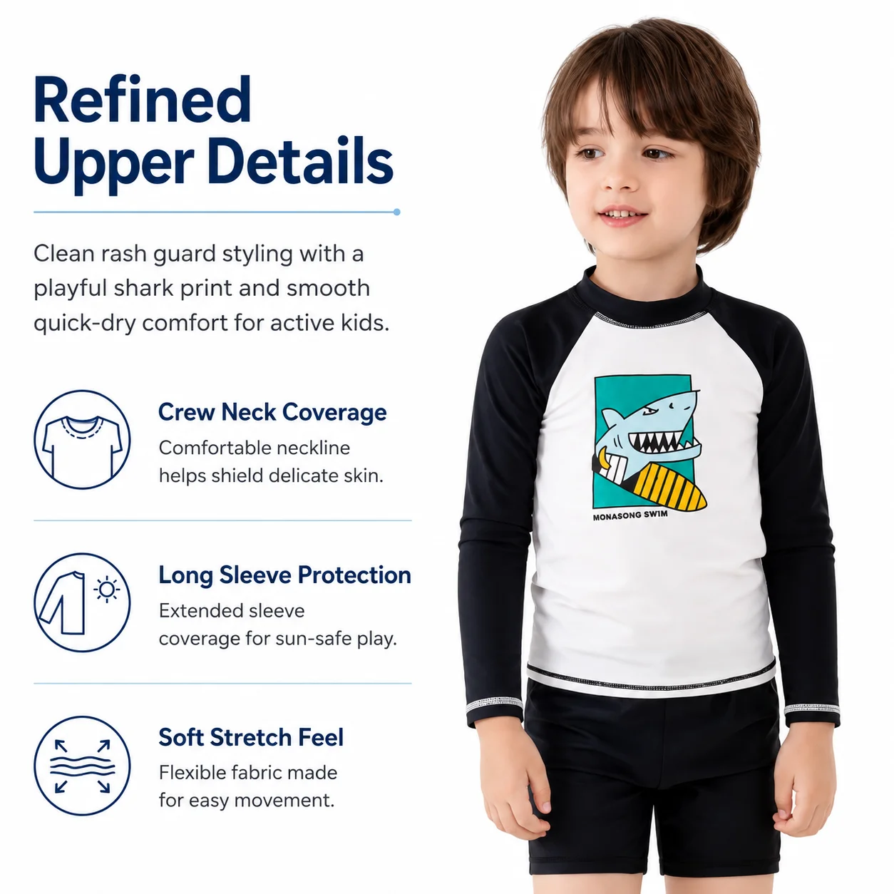

# Wholesale Kids Rash Guards: A Retailer's UPF 50+ Buying Guide

For children's swimwear buyers, a rash guard is more than a seasonal add-on. It combines practical coverage, active comfort and playful design in a product parents already understand, with natural opportunities to sell coordinated accessories.

This concise guide explains what to check when sourcing **wholesale kids rash guards**, from fabric and fit to minimum order quantities and customization.

## Why rash guards work in a children's swimwear range

Parents often want several things at once: sun-conscious coverage, a comfortable fit for active play and a design their child will enjoy wearing. Long-sleeve rash guards cover the shoulders and arms, while coordinated shorts make the outfit easy to understand and merchandise as a complete set.

For retailers, a rash guard can also anchor a clear collection story. Ocean prints can sit with water shoes and sun hats; softer colorways can support a resort edit; coordinated accessories can turn one item into a higher-value water-day bundle.

## 1. Start with fabric performance

UPF describes how effectively a textile limits ultraviolet radiation from passing through the fabric. **UPF 50+** gives buyers and parents a clear performance reference, but it should not be treated as a marketing label alone. Ask the supplier how the fabric is selected, inspected and tested, and request relevant documentation for your destination market.

MOMASONG's [quality process](https://momasong.com/quality) describes incoming fabric inspection, production checks and safety and performance testing. Remember that protective clothing covers only the area beneath the garment; sunscreen and other sun-safe practices are still needed for exposed skin.

## 2. Test comfort in real movement

Children swim, run, climb and sit in the same outfit, so evaluate more than appearance. During sample approval, check:

- stretch and recovery after movement;
- seam alignment and smoothness;
- a secure but comfortable neck opening;
- waistband comfort on coordinated shorts;
- opacity and hand feel when wet;
- drying behavior between activities.

A physical sample is the best place to review stitching, print alignment, ease of dressing and overall fit before bulk production begins.

## 3. Plan sizes around your customers

Do not rely only on labels such as 4T, 6 or 10, because sizing conventions vary between brands and markets. Compare garment measurements with your previous sales and customer profile. MOMASONG provides a [size and fit guide](https://momasong.com/size-guide) to support range planning.

For a first order, a focused size curve is usually more useful than spreading stock thinly across every possible size, print and color. Early sales data can then guide the next reorder.

## 4. Choose prints that tell one clear story

Children respond to recognizable motifs, while retailers need a collection that looks coherent online and in store. Ocean animals, tropical colors and nature-inspired prints connect naturally with beach and pool use.

The MOMASONG **Boys Shark Print Rash Guard Set — Coral Reef (LW-SW07)** can act as a lead product in an ocean-themed edit. When comparing designs, consider whether the print reads clearly in a small product thumbnail, coordinates with existing accessories and remains balanced across the full size range.

A compact group of related designs is often easier to market than a large assortment of unrelated prints.

## 5. Review construction and quality control

For rash guard sets, ask the supplier to check stitch consistency, seam alignment, print placement, fabric elasticity, waistband security and measurement consistency. Zip-up styles also need smooth zipper movement and a comfortable zipper guard.

MOMASONG outlines a manufacturing process with sample development, bulk production, multi-step inspection and final delivery. Buyers considering custom development can review the complete [OEM/ODM process](https://momasong.com/oem-odm) before preparing an inquiry.

## 6. Use MOQ to test a focused range

MOQ affects how much variety a retailer can introduce and how much capital is committed to a new design. MOMASONG lists starting flexibility of 50–100 pieces per style or color for custom programs, although the exact requirement depends on the product and customization scope.

Always confirm the quantity, size breakdown, colors, packaging and shipping terms in a written quotation. A practical first order might combine one strong lead print, one complementary style, a measured size curve and a small selection of accessories.

## Ready-to-order or private label?

Ready-to-order wholesale styles suit buyers who prioritize speed and established silhouettes. Private-label development is more appropriate when a brand needs exclusive prints, custom labels, specialized packaging or its own size specifications.

For a useful quotation, share your target market, estimated quantity, size range, preferred fabric, artwork or reference images, packaging needs and delivery window. A clear brief helps the manufacturer recommend the right process and provide more accurate terms.

## Frequently asked questions

### What does UPF 50+ mean in children's swimwear?

UPF is a textile sun-protection rating. A UPF 50+ garment is designed to allow only a small fraction of ultraviolet radiation through the covered fabric. It complements rather than replaces sunscreen for exposed areas.

### What is MOMASONG's typical MOQ for custom rash guards?

MOMASONG lists starting flexibility of 50–100 pieces per style or color for custom swimwear. Exact quantities vary by design, fabric, print method and customization, so buyers should confirm them in a project quotation.

### Can rash guards be customized for a private label?

Depending on the project, customization can include prints, colors, fabrics, woven labels, care labels, hangtags, packaging and size grading.

## Build a focused rash guard collection

Strong wholesale kids rash guards balance fabric performance, comfort, clear design and reliable production. Start with a defined customer, test a focused assortment and use sample approval to verify the important details before committing to bulk stock.

Explore MOMASONG's [wholesale kids swimwear](https://momasong.com/shop), review its [custom manufacturing options](https://momasong.com/oem-odm), or [request a quote](https://momasong.com/contact) for a ready-to-order or private-label program.
