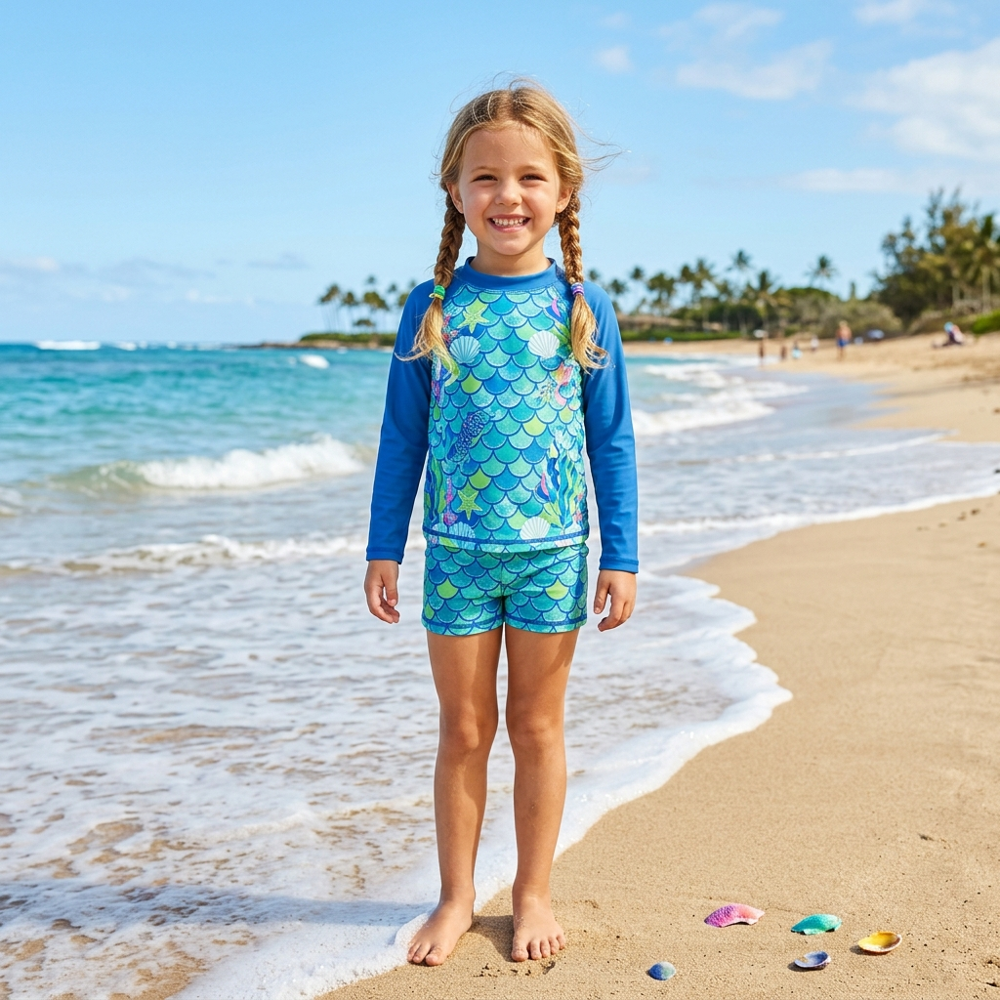

# Kids Swim Dress Wholesale: How to Build a Focused Girls' Swimwear Edit

A swim dress can make a girls' swimwear rail feel immediately more considered—but only if it earns its place. Buyers are often tempted to add every appealing print, then discover that the range lacks a clear story, the size selection is too thin, or the product page does not explain what makes the silhouette useful.

For **kids swim dress wholesale** planning, the better question is not “Which design is prettiest?” It is “Which product role will this style play in the collection?” A well-chosen swim dress can give parents a recognisable one-piece option and give retailers a distinctive visual anchor for a coordinated beach or pool edit.

## Give the swim dress a clear job in the range

A swim dress is not simply a one-piece with a decorative layer. It is a silhouette that can help shoppers navigate a crowded girls' category. Its familiar dress-like shape may appeal to families looking for a playful, all-in-one beach option, while its one-piece construction keeps the assortment legible beside rash-guard sets, two-piece sets and accessories.

Start by assigning the style one of three roles:

- **The hero print:** a memorable design that carries the campaign image and window display.
- **The easy option:** a versatile colour or print that sits comfortably with existing accessories.
- **The brand signature:** a custom design that brings a private-label story to life.

Trying to make one SKU do all three often produces too many trims, colours and messages. A focused choice makes buying, photography and staff recommendations simpler.

## Choose kids swim dress wholesale styles with the customer journey in mind

Product selection begins before a garment reaches the fitting room. Think through the actual moment of purchase: a parent is comparing coverage, comfort, design and value in a few seconds, often from a small online image. Your product page and sample review should answer practical questions without turning the item into a technical lecture.

MOMASONG's current collection includes Girls Premium Swim Dress styles, alongside one-piece suits, two-piece sets and rash guards. That breadth creates a useful merchandising opportunity: a swim dress can be the soft, expressive option in a small capsule rather than an isolated novelty.

For each candidate, ask:

- Does the print remain clear in a thumbnail and at a distance?
- Can the colours connect naturally to a sun hat, water shoes or towel?
- Is the shape easy to distinguish from the other one-piece styles in the same edit?
- Does the proposed size curve reflect your past girls' swimwear sales?

These questions are more useful than chasing a long list of seasonal motifs. A cohesive four- or six-style edit is often easier for a retailer to explain and replenish than a large group with no visual connection.

## Protect comfort and fit during sample review

A beautiful concept still needs a disciplined sample check. Children move between water play, sand, poolside snacks and car rides in the same garment. During sample approval, review the garment as a product for real activity: look at stretch and recovery, seam alignment, comfort at openings, placement of decorative details, and how the garment sits through ordinary movement.

Compare garment measurements with your target market rather than assuming a size label means the same thing everywhere. MOMASONG's [size guide](https://momasong.com/size-guide) is a helpful starting point for discussing fit, but your own sales history should shape the final size breakdown.

It is also worth looking at the design from a parent’s perspective. Can the item be identified quickly in a busy product grid? Does the print look balanced across sizes? Is there a simple way to pair it with an accessory? Good answers make the buying decision feel easier, which is exactly what a retail range should do.

## Build a capsule, not a pile of options

The strongest girls swim dress wholesale assortment is usually a small system. Begin with a lead swim dress, add one coordinated active option such as a rash-guard set, and finish with accessories that make sense for the same outing. MOMASONG’s [shop](https://momasong.com/shop) groups swimwear with items such as wide-brim UV sun hats, quick-dry water shoes and hooded beach towel ponchos—useful reference points when planning a complete water-day story.

Keep the connection tangible. A mermaid or ocean-themed swim dress can sit with a beach towel or sun hat in compatible tones; a tropical print can support a holiday-focused storefront edit. Avoid forcing a bundle just to raise the item count. Each addition should solve a parent need, reinforce the visual story, or make merchandising more useful.

## When private label adds real value

Private label is most persuasive when it makes the range more recognisable, not when it adds change for its own sake. If you have a distinctive print direction, branded labels, packaging requirement or preferred fit brief, bring those decisions into the conversation early.

MOMASONG describes an [OEM/ODM process](https://momasong.com/oem-odm) that moves from inquiry and design through physical sample development, bulk production and quality checks. For a productive first discussion, share your target market, reference images, intended age range, colour direction, estimated quantity, labelling needs and desired launch window. The supplier can then advise on the appropriate development path and project-specific terms.

## Frequently asked questions

### What should a retailer check before buying a kids swim dress wholesale range?

Review fit and movement in a sample, compare measurements with your customer base, check the clarity of the print, and decide how the style works with the rest of the assortment. Confirm project-specific quantities, materials and delivery terms directly with the supplier.

### How can a swim dress fit into a broader girls' swimwear collection?

Use it as a hero one-piece, then surround it with only the supporting styles and accessories that create a clear beach or pool story. The goal is a coherent edit, not the maximum number of choices.

### Can a swim dress be developed for a private label?

Private-label projects can begin with a clear brief covering artwork, fit references, labels, packaging and planned quantities. Review the manufacturer’s sample process before approving bulk production.

## Create a swim dress edit shoppers can understand

The best **kids swim dress wholesale** decisions connect product, fit and presentation. Choose a silhouette with a defined role, verify the practical details in a sample, and build only the supporting products that strengthen the story. That approach gives parents an easier choice and gives your brand a more confident girls' swimwear offer.

Explore MOMASONG's [children's swimwear collection](https://momasong.com/shop), review [custom swimwear options](https://momasong.com/oem-odm), or [request a project quote](https://momasong.com/contact) when you are ready to plan a focused range.
