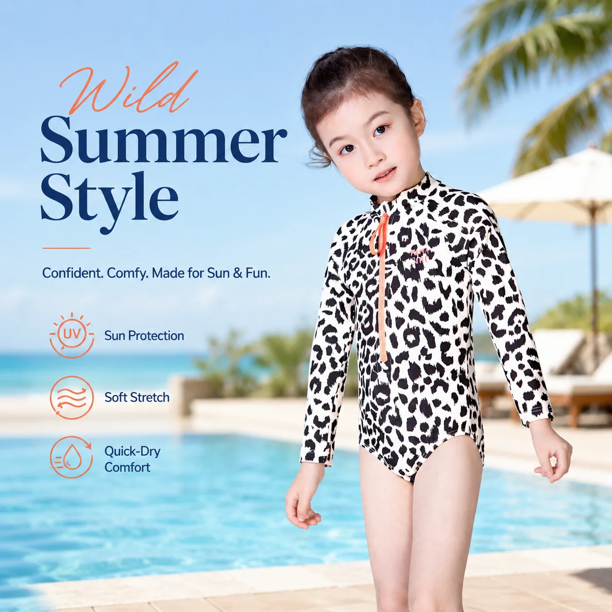

# Girls One-Piece Rash Guard Swimsuit: A Retailer’s Better-Buying Guide

A girls one-piece rash guard swimsuit can solve an awkward problem on a busy shop floor: parents want easy coverage for beach days, while children still want a style that feels like *their* swimsuit. The strongest assortment does not treat the one-piece as a compromise between a rash guard and a suit. It treats it as its own clear use case.

For retailers and private-label teams, that means choosing styles with a job to do, explaining that job simply, and avoiding a rail full of near-duplicates. Here is a practical way to build an edit that makes buying easier for families and planning easier for your brand.

## Why a girls one-piece rash guard swimsuit earns its place

A one-piece rash-guard design brings the coverage of a swim top and the simplicity of a one-piece together. That is useful when a parent is shopping for a beach holiday, outdoor water play or a swim lesson routine and does not want to coordinate separate pieces.

The category also gives a retailer a clean bridge between fashion-led girls’ swimwear and functional rash guards. MOMASONG’s live [shop collection](https://momasong.com/shop) separates Girls Swimwear, Rash Guards and One-Piece Swimsuits, which is a helpful reminder that customers may arrive through different needs even when they end up choosing the same style.

The commercial opportunity is clarity. Instead of presenting every long-sleeve design as interchangeable, describe the one-piece as an all-in-one option for customers who value straightforward dressing and coverage for water activities. Keep the product language specific to the style actually offered; do not promise features that are not listed on its product page.

## Build the edit around occasions, not just prints

Print is often the first thing a child notices, but it is rarely the whole buying decision. A focused girls rash guard swimsuit assortment can be planned around three easy retail moments:

### 1. The outdoor beach day

For long, sunny sessions, show the one-piece beside long-sleeve rash-guard options and sun accessories. MOMASONG’s [size and fabric guide](https://momasong.com/size-guide) describes its swimwear fabric as UPF 50+, quick-dry and four-way stretch, and advises a snug but comfortable fit for movement. Use those site-supported details only where they apply to the selected item.

### 2. The pool-class routine

Pool families tend to value a fuss-free piece that is easy to recognize, pack and put back on. A small group of clean, legible prints can be more useful than an overextended wall of novelty designs. Merchandising the one-piece close to practical towels or bags can make the trip-to-pool use case visible without turning the category into a bundle requirement.

### 3. The holiday gift or seasonal refresh

This is where a distinctive print carries real weight. The live MOMASONG range includes Girls One-Piece Rash Guard Swimsuit styles, giving retailers a useful starting point for a named, story-led print direction. A few recognizable themes help a buyer build a collection narrative, while a balanced mix of quieter alternatives keeps the rail workable for more customers.

## Use fit information as a selling tool

Fit uncertainty is one of the fastest ways to lose a swimwear sale. Retail staff and product pages should point families to measurements, not just an age label. MOMASONG’s published [size chart](https://momasong.com/size-guide) maps height, chest, waist and hip measurements across its range and suggests sizing up when a child is between sizes for longer wear.

For a buying team, that suggests two practical checks. First, make size guidance visible next to the one-piece selection rather than burying it in a general policy page. Second, review your size curve against the customers you serve before filling every print in every size. A tighter, considered spread can be more useful than a broad grid that leaves obvious gaps.

## Make the product page answer the next question

The best product copy does not merely repeat “cute,” “comfortable” and “sun-safe.” It answers the question a shopper asks after liking the print: *Is this the right style for our kind of water day?*

For each girls one-piece rash guard swimsuit, lead with the sleeve and one-piece format, then give the parent a short occasion cue. Follow with a direct route to the size guide. If a buyer needs a branded version or a collection built around a new print direction, connect the product story to MOMASONG’s [OEM/ODM process](https://momasong.com/oem-odm), which outlines inquiry, design and quote, sample development, production and quality-check stages.

That sequence is also valuable for private-label planning. Start with the customer moment, then decide on silhouette, print family, size plan and the brand details needed to make the range recognizably yours. It is a better brief than asking for “more girls’ swimwear,” and it leaves room for the physical sample review described in the OEM/ODM workflow.

## Keep the assortment disciplined

One-pieces become difficult to shop when every option competes for the same reason. Give each style a clear role: an active-beach option, a print-led holiday option, or a familiar pool-class choice. Then use photography and copy to make the distinction obvious.

The goal is not to force one silhouette on every family. A two-piece set may suit one customer, while another values the all-in-one ease of a girls one-piece rash guard swimsuit. A balanced collection lets the shopper choose confidently rather than decode technical labels.

## Frequently asked questions

### How should retailers position a one-piece rash guard?

Position it as an all-in-one swim option for families who want coverage and uncomplicated dressing. Pair the message with the actual sleeve length, fabric details and size guidance published for the item.

### Should a one-piece replace two-piece rash guard sets?

No. It should complement them. A concise assortment gives shoppers a meaningful choice between an all-in-one piece and a separate top-and-bottom format.

### What should a private-label brief include?

Include the intended water activity, silhouette, print direction, size range and branding requirements. MOMASONG’s OEM/ODM page explains that the process includes sample development before bulk production.

## Make the next collection easier to choose

A thoughtful girls one-piece rash guard swimsuit edit can give families a quicker yes and give retailers a sharper story than a generic seasonal rail. Review the current [MOMASONG swimwear collection](https://momasong.com/shop), use the published size guide to support fit decisions, and [contact the MOMASONG team](https://momasong.com/contact) when you are ready to discuss a wholesale or private-label direction.
