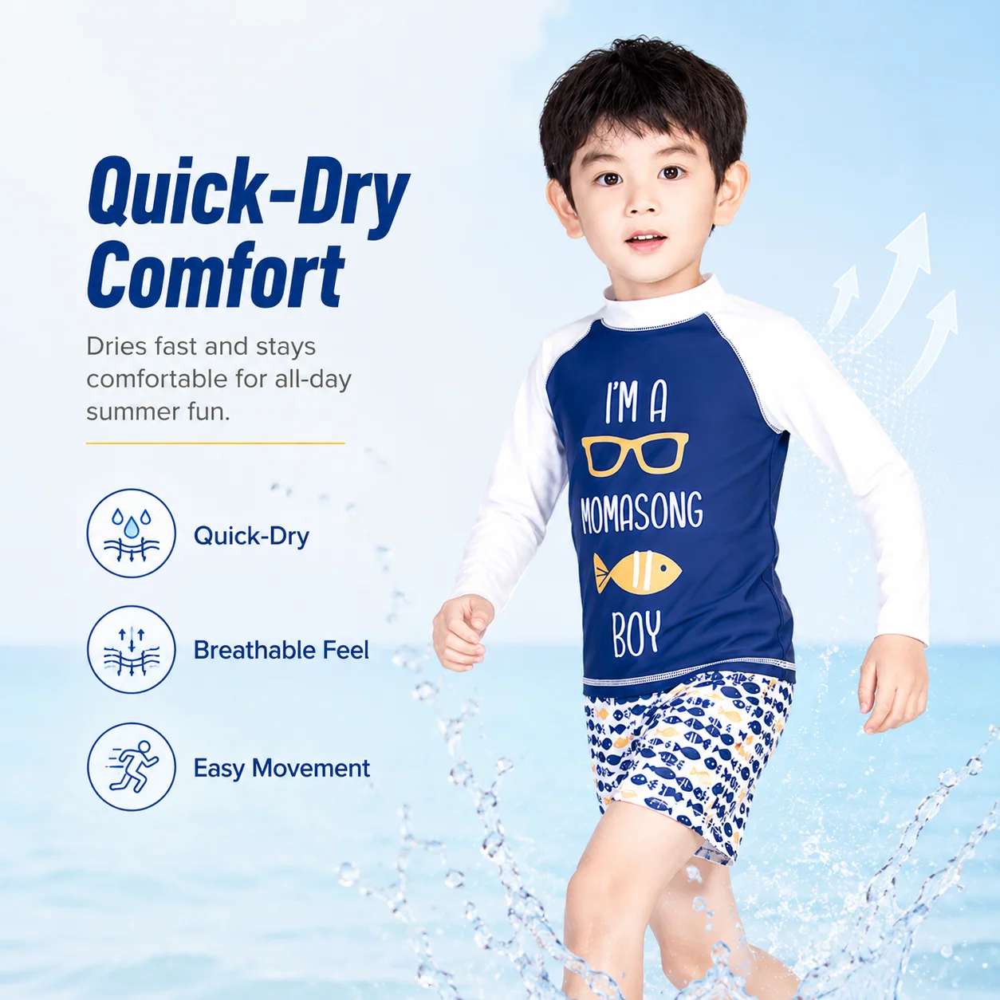
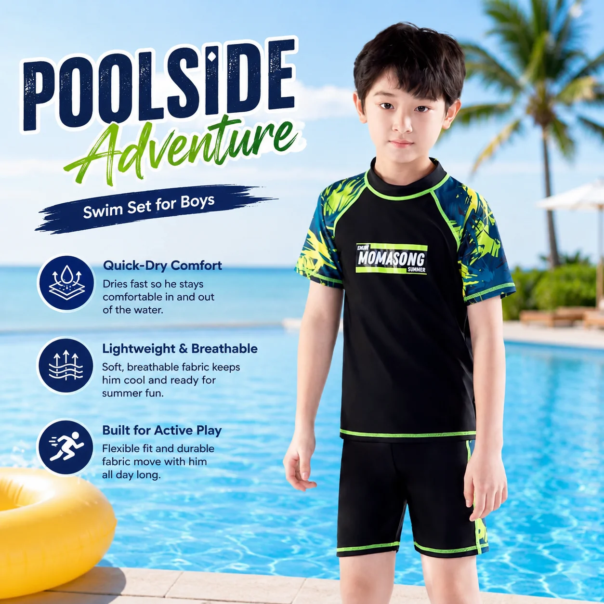

# Boys Swimwear Wholesale: How to Build a Practical Retail Assortment

Buying boys’ swimwear wholesale is rarely just a matter of choosing the most colorful trunks. A good retail assortment has to cover different kinds of water play, different levels of sun exposure, and the size range your customers actually need. It also has to be simple enough for a buyer to reorder when the season picks up.

A better starting point is to build the range around a few clear product roles, then use color, print, and accessories to give it personality.

## Start with the way boys actually swim

A boys’ swimwear range may serve swimming lessons, pool holidays, beach trips, water parks, and everyday summer play. Those occasions overlap, but they do not always call for the same garment.

Before placing an order, divide the collection into three practical use cases:

- **Pool and lessons:** Secure fits, easy movement, and styles that can handle a regular swim routine.
- **Beach and outdoor play:** More coverage, UPF-rated options, and quick-dry layers can be useful for longer days outside.
- **Easy everyday wear:** Straightforward swim shorts and two-piece sets that children can put on and take off with less help.

This makes the assortment easier to merchandise and gives sales staff a useful answer when a customer asks, “Which one is best for my child?”

## Build the range around three core styles

### 1. Rash guard sets for coverage

Rash guard sets are a strong foundation for a boys’ collection because they combine a top and bottom in one easy outfit. Long-sleeve versions can appeal to families looking for more coverage, while short-sleeve options give the collection a lighter choice for hot days.

When reviewing a boys rash guard wholesale program, look beyond the print. Check the fabric specification, sleeve construction, neckline, waistband, size grading, and care instructions. The garment should feel comfortable during movement and be straightforward for a retailer to describe.

*MOMASONG Boys Premium Rash Guard Shorts Set – Tropical Wave. [View the product](https://momasong.com/products/lw-sw01.html).*

### 2. Two-piece sets for flexibility

Two-piece swim sets give older children more independence and make changing easier during a busy beach or pool day. They can also give buyers more flexibility when planning colors and sizes across a collection.

For a wholesale boys’ swimwear range, use two-piece sets to balance the more covered rash guard styles. Look for comfortable waistbands, practical proportions, and color options that work with the rest of the assortment.

*MOMASONG Boys Two-Piece Swim Set – Wave Rider. [View the product](https://momasong.com/products/lw-sw15.html).*

### 3. Swim shorts and simple separates

Swim shorts are often the easiest entry point for a customer who wants a familiar style. They can also help a retailer create a lower-commitment test option before expanding into a wider collection.

Keep the range disciplined. A few strong silhouettes in coordinated colors are easier to replenish than many nearly identical styles. If the collection includes matching rash guard tops or accessories, show those relationships clearly on the product page and in the store.

## Use fabric benefits as buying filters

Product features matter most when they help a buyer decide where a style belongs. For a boys’ collection, useful filters may include:

- UPF 50+ protection where supported by the approved product specification
- Quick-dry performance
- Chlorine resistance for pool-focused styles
- Four-way stretch for active movement
- Recycled or certified fabric options where documented
- Clear washing and drying instructions

MOMASONG’s [Size Guide & Fabric Care](https://momasong.com/size-guide) describes UPF 50+, quick-dry, chlorine-resistant, and four-way-stretch fabric features. Its [Quality page](https://momasong.com/quality) also explains material and production checks. Buyers should confirm the exact approved specification for each SKU before using a performance claim in retail copy.

## Plan the size curve before the color curve

Prints are exciting, but sizing determines whether a collection is useful on the sales floor. Review the age groups and body measurements your store serves, then plan the size curve across the range instead of product by product.

It is also worth checking how the same size labels fit across rash guard sets, two-piece outfits, and shorts. A clear size chart reduces customer hesitation and makes repeat buying easier. Use the [MOMASONG size guide](https://momasong.com/size-guide) as a reference, then confirm the final measurements and grading for custom styles before production.

## Ask the supplier questions that affect reorders

Price is only one part of a wholesale decision. Before approving a boys’ collection, ask the supplier:

1. What is the final MOQ by style and color?
2. Which sizes and colors can be repeated in a later order?
3. What is included in the sample approval process?
4. Which fabric and performance claims are documented for each style?
5. How are measurements checked during production?
6. What lead time should the buyer plan for sampling and bulk production?

MOMASONG’s [OEM/ODM process](https://momasong.com/oem-odm) connects design, sample development, production, quality checks, and delivery. For private-label buyers, discussing those steps early is more useful than waiting until the purchase order is ready.

## Make the collection easy to sell

A practical boys’ swimwear wholesale assortment does not need dozens of products. It needs a clear balance: rash guard sets for coverage, two-piece styles for flexibility, familiar shorts for everyday demand, and enough size and color depth to support reorders.

That structure gives buyers a collection they can explain, test, and expand. To discuss boys’ swimwear, custom colors, private labels, or a broader kids’ collection, [contact MOMASONG](https://momasong.com/contact) for product and wholesale information.

## Frequently asked questions

### What should a boys swimwear wholesale collection include?

Start with rash guard sets, two-piece swim sets, and simple swim shorts. Add accessories selectively if they support the same beach, pool, or sun-protection story.

### Are rash guard sets suitable for pool retailers?

They can be, especially for customers looking for more coverage during lessons or outdoor swimming. Confirm the approved fabric and performance specifications for each style before making a product claim.

### How many styles should a retailer order first?

Begin with a focused mix of silhouettes, sizes, and colors. A smaller test assortment makes it easier to understand demand before committing to a broader seasonal range.

### What should buyers confirm with a kids swimwear supplier?

Confirm MOQ, size grading, fabric composition, documented performance claims, sample approval, quality checks, and production lead time before placing the order.
