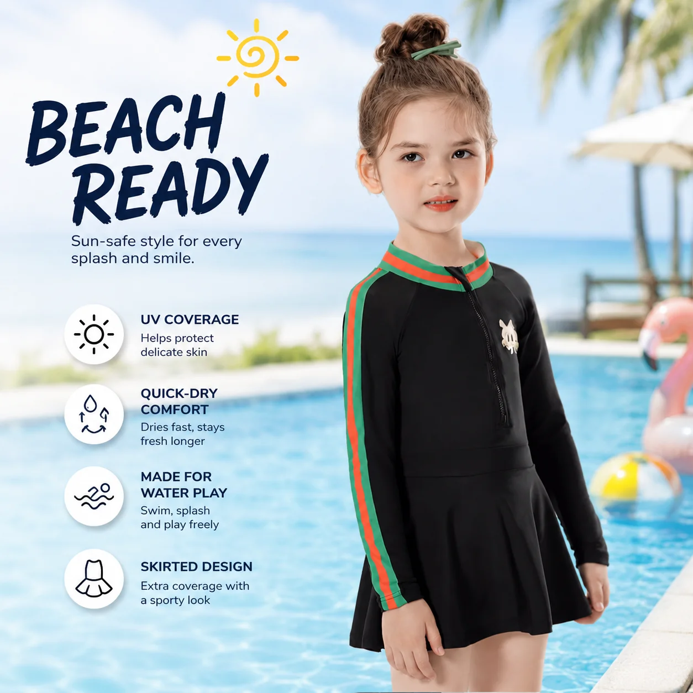

# Kids Two-Piece Swimwear Wholesale: How to Build a Balanced Retail Edit

Two-piece swimwear gives children more flexibility when getting dressed, and it gives retailers another useful shape for a seasonal collection. But adding two-piece styles is not as simple as choosing a few bright prints. Buyers still need to think about fit, coverage, size depth, color balance, and how the styles will work alongside rash guards and one-piece suits.

For buyers planning **kids two-piece swimwear wholesale**, a focused range is usually more useful than a large one: enough variety to give customers a real choice, but enough consistency to make reorders and merchandising manageable.

## Start with the customer’s reason for choosing a two-piece

Two-piece swimwear can serve different customers. Some parents value easier changing and bathroom breaks. Older children may want more independence when dressing. Retailers may also use two-piece sets to create coordinated looks across colors, prints, and sibling collections.

Before selecting products, decide which role the two-piece range will play:

- **Everyday pool use:** Comfortable, easy-to-wear sets with clear size information.
- **Beach and holiday collections:** More visual variety, playful prints, and coordinated accessories.
- **Active outdoor use:** Options with more coverage, such as a rash guard top and matching bottom.
- **Fashion-led girls’ collections:** Ruffles, swim dresses, and statement prints balanced with simpler core styles.

This keeps the buying decision connected to customer needs instead of treating every two-piece style as interchangeable.

## Choose a practical mix of silhouettes

A retailer does not need every possible two-piece shape. Most small collections only need three useful groups:

### Rash guard sets

These combine a swim top with matching bottoms and can provide more coverage for outdoor play, beach trips, and active swimming. They also help a buyer connect the two-piece range with the store’s UPF and sun-protection story where those claims are supported by the approved specification.

### Classic two-piece swim sets

These are straightforward styles for customers who want a flexible alternative to a one-piece. When comparing a **kids two piece swimsuit wholesale** range, check the fit of both pieces, not only the appearance of the top. Waistband comfort, secure openings, lining, and size grading all affect whether the set feels easy to wear.

*MOMASONG Boys Two-Piece Swim Set – Wave Rider. [View the product](https://momasong.com/products/lw-sw15.html).*

### Ruffle and fashion-led sets

For **girls two piece swimwear wholesale**, ruffles, trims, and print direction can give the collection more personality. Use these as visual anchors, then balance them with simpler colors or related styles that are easier to reorder.

*MOMASONG Girls Ruffle Two-Piece Swimsuit – Coral Reef. [View the product](https://momasong.com/products/lw-sw22.html).*

For buyers building a broader girls’ edit, a swim dress can provide a related fashion-led option without asking every customer to choose a two-piece. It can sit beside the two-piece range as a complementary silhouette.

*MOMASONG Girls Premium Swim Dress – Mermaid Magic. [View the product](https://momasong.com/products/lw-sw21.html).*

## Treat coverage as a buying decision, not a product afterthought

Two-piece does not have to mean limited coverage. Retailers can create a more useful assortment by carrying different top lengths and layering options.

For example, a collection might include:

- Short-sleeve or sleeveless sets for lighter coverage
- Long-sleeve rash guard sets for outdoor use
- Higher-back tops for a more secure fit
- Swim dresses for customers who want more coverage with a fashion-led shape
- Coordinated hats or cover-ups for the rest of the beach day

MOMASONG’s [Shop page](https://momasong.com/shop) includes two-piece sets alongside rash guards, one-piece swimsuits, girls’ swimwear, boys’ swimwear, and accessories. That broader view helps buyers compare the role of each style before deciding how much depth to order.

## Plan the size range across both pieces

A two-piece set only works well if the top and bottom feel balanced in the same size. Ask the supplier how the measurement chart was developed and whether the grading is consistent across the collection.

Before approving a wholesale order, review:

- Height, chest, waist, and hip measurements
- Waistband width and stretch
- Top length and arm opening
- Bottom coverage and rise
- Lining and opacity
- Fit guidance for children between sizes

The [MOMASONG Size Guide & Fabric Care](https://momasong.com/size-guide) provides height and body-measurement guidance, as well as fit tips for children’s swimwear. For custom styles, confirm the final chart and grading with the factory rather than relying only on a general size label.

## Use color to connect boys’ and girls’ collections

Retailers selling both boys’ and girls’ swimwear do not need identical products. A shared accent color, ocean theme, or print family can be enough to make the collections feel related.

For example, a coral or ocean palette can connect a girls’ ruffle set, a boys’ two-piece set, and a rash guard without making the products look like uniforms. That gives families a clearer path when shopping for siblings and gives the buyer more flexibility when planning product photography.

## Pair two-piece styles with functional product information

Visual appeal helps a product get noticed, but useful details help it convert. Each wholesale listing should make the following information easy to find:

- Fabric composition and care instructions
- Size chart and measurement method
- Coverage description
- UPF 50+ or other performance claims where documented
- Available colors and sizes
- MOQ and sample information for wholesale buyers
- Related rash guards, accessories, or matching styles

MOMASONG’s [Quality page](https://momasong.com/quality) describes material and production checks, while the [OEM/ODM page](https://momasong.com/oem-odm) explains customization, sample development, quality checks, and delivery. Link those details from the product page when a buyer needs more confidence before requesting a quote.

## Keep fashion-led styles balanced with repeatable core products

An assortment built entirely around high-detail prints can be difficult to reorder. A more controlled approach is to divide the range into:

- **Core styles:** Reliable shapes and colors with deeper size coverage.
- **Seasonal styles:** New prints or trims used to create excitement.
- **Test styles:** Smaller buys that help measure customer response.

This structure gives a retailer room to respond to trends without making the whole season dependent on one design. It also gives a private-label brand a clearer basis for its next collection.

## Ask the supplier the right questions before confirming the order

Before placing a **wholesale kids swimwear** order, confirm the final MOQ by style and color, sample approval process, size grading, fabric specification, labels, packaging, and production timing. These details can vary by product and should appear in the final quotation.

To discuss two-piece swimwear, custom colors, private labels, or a broader children’s collection, [contact MOMASONG](https://momasong.com/contact) with your assortment brief.

## Frequently asked questions

### Are two-piece swimsuits suitable for younger children?

They can be, depending on the design, fit, coverage, and customer preference. Retailers should offer clear size information and provide alternatives such as one-piece and rash guard styles.

### What makes a good two-piece swimwear wholesale range?

A balanced range includes practical core styles, a few fashion-led options, consistent sizing, useful coverage choices, and enough color depth to support reorders.

### Should boys’ and girls’ two-piece styles match?

They do not need to match exactly. Shared colors, themes, or print details can create a connected collection while allowing each product to keep its own identity.

### What should buyers confirm with a kids swimwear supplier?

Confirm measurements, fabric, lining, care, documented performance claims, MOQ, sample approval, packaging, and production timing before placing the order.
