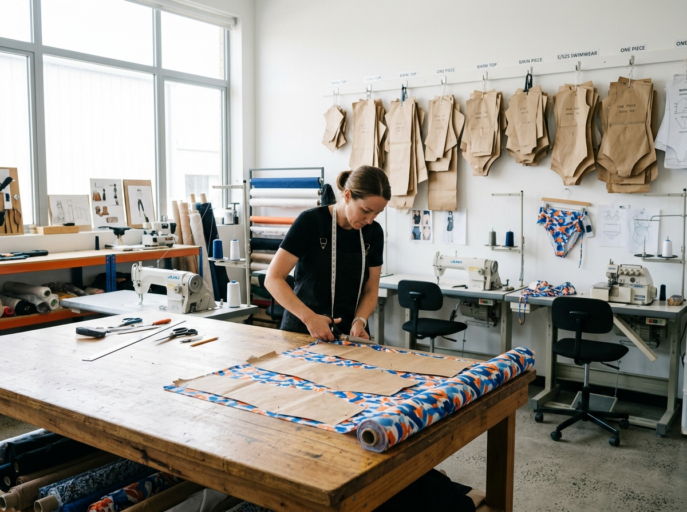

# Custom Swimwear Sample Development: The Questions That Protect a Kids' Range

A sample can look brilliant on a rail and still leave a retailer with the wrong questions unanswered. Does the sleeve feel right when a child reaches? Does the print still read as the brand intended? Will the set make sense beside the rest of the collection? Those are not finishing touches. They are the real work of **custom swimwear sample development**.

For a private-label children’s range, the sample room is where a broad idea becomes a series of decisions a buyer can stand behind. MOMASONG’s [OEM/ODM process](https://momasong.com/oem-odm) places physical fit samples between design alignment and bulk production. That order matters: it gives a team a chance to resolve the things a sketch, mood board, or rendered mockup cannot fully answer.

## Start custom swimwear sample development with the customer in view

The most useful sample request begins with a real retail situation. Picture the parent comparing two rash-guard sets online, or the buyer editing a compact holiday assortment. What should make this piece easy to choose? A bright print may be the hook; an easy-to-understand coordinated set may be the reason it earns a place in the range.

Put that purpose into the brief. Share a sketch, reference images, or a tech pack, then add the facts that explain the commercial job of the style: intended customer, selling season, target size range, key design details, and how the piece relates to the collection. MOMASONG lists ideas, sketches, and tech packs as starting inputs in its OEM/ODM workflow.

The point is to distinguish decisions from inspiration. A seaside color palette is inspiration; an approved logo placement on a coordinated set is a decision. That distinction helps a kids swimwear factory respond with fewer assumptions.

## Use the sample to test the whole product story

An approved sample should answer more than “Do we like it?” Review it in the order a customer will encounter it:

- **First impression:** Is the silhouette recognisable from a product image or a fixture? Does the artwork look considered at the actual scale?
- **Wear and fit:** Look at neckline, sleeves, waist, seams, labels, and closures with the intended wearer in mind. Make notes on what needs a second look rather than treating a first try-on as a final approval.
- **Range logic:** Lay related styles together. Check whether colors, trims, and print scale support a deliberate collection rather than a group of isolated products.
- **Brand recognition:** Confirm the private-label details you have chosen—such as labels, care tags, hangtags, or packaging—are consistent with the brief. MOMASONG identifies these branding options on its OEM/ODM page.

This is where retailers can add their distinctive value. A factory can translate an agreed direction into a sample; a buyer brings knowledge of the customer, the assortment, and the way the product must be explained at sale. The strongest feedback combines both perspectives.

## Make feedback easy to act on

The sample review often becomes messy when comments are scattered across email threads, photos, and calls. One consolidated review document is a quiet advantage. Use annotated images or a numbered list, and label each point as approve, revise, or question.

Be concrete. “Make it more premium” is difficult to turn into an action. “Confirm the artwork placement against the approved reference; review whether the neck label is comfortable in this position” gives the team something they can check. If two stakeholders disagree, record the decision owner and the deadline rather than passing an unresolved preference into the next stage.

For sizing, start from the commercial promise of the range. MOMASONG’s [size guide](https://momasong.com/size-guide) can help teams discuss published measurements and fit guidance, but final grading and product-specific fit should be reviewed for the target market and style. The sample is an opportunity to make that review deliberate.

## A sample is a checkpoint, not a photo shoot

There is a tempting moment when a sample photographs well: the team wants to move forward. But a compelling image is evidence of one thing, not every thing. Before bulk approval, bring the original brief back into the room.

Ask these five questions:

1. Does the sample still deliver the customer benefit we defined?
2. Are the design, artwork, and branding details aligned with the approved direction?
3. Have fit and sizing questions been recorded and resolved for this style?
4. Can the retail team explain how this piece belongs in the assortment?
5. Does the written approval clearly state what is approved and what remains open?

MOMASONG’s workflow then moves from sample development to bulk production and a quality-check stage that includes inspections for stitching, colorfastness, and sizing criteria. Keeping a clean approval record gives everyone a more dependable reference as the project progresses. It also prevents a team from relying on memory when product pages, photography, and launch materials are being prepared later.

## Why a thoughtful sample review helps private-label kids swimwear

Private-label kids swimwear has to carry two stories at once: the child-facing appeal of the garment and the parent-facing confidence behind the purchase. A thoughtful sample review connects them. It tests whether a style looks like the collection the brand promised, while giving the buyer a disciplined place to raise the practical questions.

That is why **custom swimwear sample development** deserves more attention than a sign-off meeting. Treat it as a working session that turns a concept into a shared standard. The better the questions at this point, the clearer the collection can be for the people who eventually choose it.

## Frequently asked questions

### What should a buyer send before a kids swimwear sample is developed?

Start with a sketch, reference images, or a tech pack. Add the intended styles, size range, key features, and the private-label details that matter to the collection. MOMASONG’s OEM/ODM page identifies those early inputs as part of its inquiry stage.

### When should a private-label brand review a sample?

Review the physical fit sample before approving bulk production. Use the session to consider fit, artwork, collection coordination, branding details, and the feedback that still needs a documented decision.

### Can MOMASONG help with branded kids swimwear details?

MOMASONG’s OEM/ODM page lists custom woven neck labels, screen-printed care tags, hangtags, and custom packaging options. Confirm the appropriate details and approvals for your project directly with the team.

## Turn your next sample into a clearer decision

Planning a new range? Use **custom swimwear sample development** to bring the buyer, brand, and product story into the same conversation. Explore MOMASONG’s [OEM/ODM capabilities](https://momasong.com/oem-odm) and [contact the team](https://momasong.com/contact) with your brief, references, and the questions you want the sample to answer.
