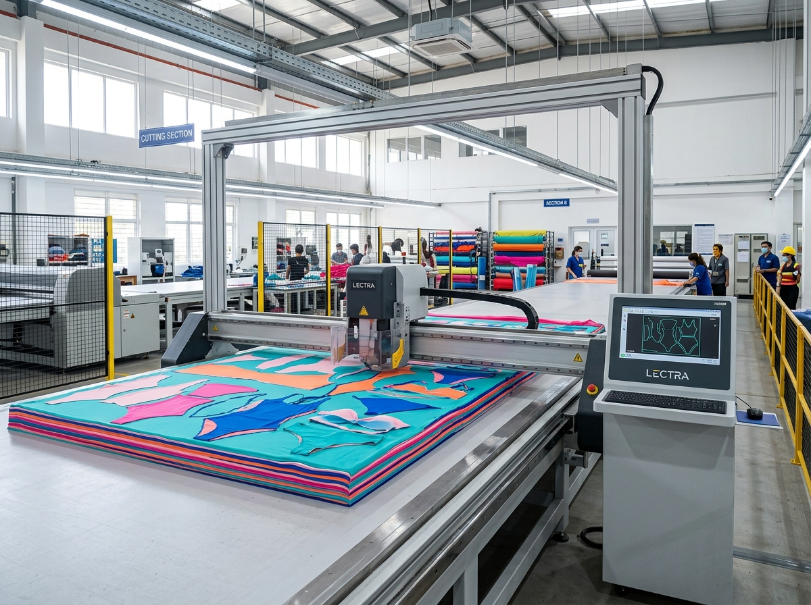

# OEM Kids Swimwear: The Design Handoff That Makes a Collection Easier to Build

A retailer can arrive with a lively moodboard, a promising print direction and a launch season in mind—and still leave a factory with a dozen unanswered questions. That gap is where custom projects lose momentum. For **OEM kids swimwear**, the most useful early deliverable is not a perfect presentation. It is a design handoff that tells the development team what must stay true when an idea becomes a garment.

This matters especially in childrenswear. A coordinated range has to make sense across styles, sizes and parent expectations, not only in a single attractive sketch. A clear handoff gives the buyer, designer and production team one shared version of the collection before physical sampling begins.

## Start an OEM kids swimwear brief with the retail decision

The strongest briefs begin with the commercial decision the collection needs to support. Is the range a focused rash-guard edit for a specialty retailer? A girls' and boys' capsule built around one print family? A private-label refresh that needs new colorways while keeping a familiar fit story?

Write that decision in one or two plain sentences. It gives every later choice a test: does this style, color or detail make the range easier to sell as the intended collection? It also helps a **kids swimwear manufacturer** understand which elements are essential and which are still open for discussion.

Then make the range visible as a system. A simple style list can record silhouettes, intended age or size coverage, color direction and each piece's role. For example, a retailer might pair a long-sleeve rash guard set with a one-piece and a matching accessory. The point is to show how the pieces belong together.

## Turn inspiration into information a development team can use

Inspiration images communicate taste, but they rarely settle the choices that affect development. Label each reference with what you are actually responding to: print scale, sleeve coverage, ruffle placement, color blocking, neckline, logo location or the overall feeling. That small discipline prevents a reference photo from being interpreted as an instruction to copy an entire garment.

For each style, separate three kinds of notes:

- **Must keep:** the recognizable design idea, such as a specific print placement or coordinated set concept.
- **Can explore:** details where the development team can propose alternatives, such as trim treatment or a secondary color.
- **Need to confirm:** questions about fit, branding, fabric direction or sizing that require a shared decision.

MOMASONG's [OEM/ODM process](https://momasong.com/oem-odm) starts with an inquiry and design-and-quote stage before physical sample development. That makes this a practical moment to share sketches, a tech pack when one exists, and focused reference material. A complete document is helpful, but clarity about what is known—and what is not—is more valuable than pretending every detail is final.

## Keep brand details connected to the garment

Private label kids swimwear is often discussed as a label or hangtag decision near the end of a project. Brand details work better when considered alongside the garment. A logo may need a different placement, scale or treatment on a small sleeve, waistband or care label.

Include the brand assets the team should use, where you imagine them appearing and which applications are optional. MOMASONG publishes custom-print, private-label and packaging options on its OEM/ODM page; use the conversation to determine which options fit the particular range rather than treating every option as a requirement. This keeps the brief specific without making claims about a style before its development is reviewed.

## Give fit and size decisions a deliberate checkpoint

Kids swimwear is not merely adult swimwear made smaller. Coverage, ease of movement and consistent proportions shape how a range is experienced. Before approving a direction, note the intended age or size span, each silhouette's priority and any observed fit concerns.

MOMASONG's [size and fit guide](https://momasong.com/size-guide) is a useful reference when aligning language around age, body measurements and fit. It should inform the conversation, not replace style-specific review. Giving fit its own checkpoint helps prevent it from becoming an afterthought once prints and branding have taken the spotlight.

## A handoff is ready when production questions have somewhere to go

A good brief does not eliminate questions. It organizes them. The design and CAD stage translates direction into a development conversation; later, inspection, cutting, sewing and quality checks rely on traceable decisions. MOMASONG describes these stages across its [OEM/ODM](https://momasong.com/oem-odm) and [quality](https://momasong.com/quality) pages.

Before moving on, ask whether someone new to the project could identify the collection goal, each style's role, the references that matter, the pending decisions and the person who can approve them. If the answer is yes, the factory team has a workable starting point. If not, a shorter, clearer brief will usually help more than another page of trend imagery.

For OEM kids swimwear, that is the overlooked advantage of a disciplined handoff: it protects the collection's point of view while leaving room for a constructive development conversation.

## Frequently asked questions

### Do I need a finished tech pack before contacting an OEM supplier?

No. MOMASONG's published process invites ideas, sketches or tech packs at the inquiry stage. Bring the most specific information you have, and clearly mark the choices that still need discussion.

### What should a retailer decide before sample development?

Define the collection goal, planned styles, reference priorities, brand assets, intended size coverage and the decisions that need approval. This gives the sample review a clear purpose.

### Can a private-label range use existing design directions?

Discuss your preferred direction with the supplier. MOMASONG's OEM/ODM page describes customization for prints, branding, packaging and sizing, but the suitability of any option should be confirmed for the individual project.

## Bring a clearer collection story to the first conversation

If you are planning OEM kids swimwear, gather your style list, references and open questions before the first call. Then [contact MOMASONG](https://momasong.com/contact) to discuss how a focused brief can move into the published OEM/ODM workflow. A clear handoff will not make every choice for you—but it makes the right choices visible early.
