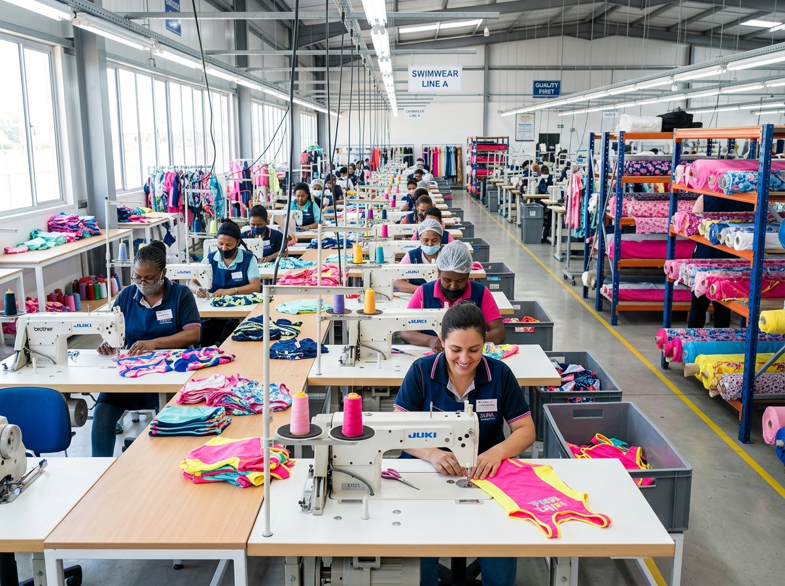

# Inside Kids Swimwear Quality Control: What Buyers Should See Before Bulk Production

Quality control becomes much easier to evaluate when a factory can show you where and when it happens. In a children’s swimwear factory, a finished garment passes through several decisions before it reaches a carton: is the fabric suitable, are the measurements consistent, are the seams secure, and does the final piece match the approved sample?

For a buyer comparing **kids swimwear quality control**, these checkpoints are more useful than a general promise that a supplier “takes quality seriously.” They show how a factory turns an approved design into a repeatable wholesale product.

## Quality starts before the fabric reaches the cutting table

The first inspection happens before production begins. If the fabric has inconsistent weight, color, or elasticity, the problem can spread through an entire order before anyone sees the finished garments.

MOMASONG describes incoming fabric inspection as a check of colorfastness, weight, and elasticity before cutting. That first step gives the production team a chance to identify a material issue before it becomes a sizing, comfort, or appearance issue in the finished product.

For buyers, this is a useful question to ask any **kids swimwear factory**: what happens to fabric before it is cut, and what information is recorded if a batch does not meet the approved specification?

*Fabric inspection and cutting are early control points in children’s swimwear manufacturing. [View MOMASONG’s OEM/ODM process](https://momasong.com/oem-odm).*

## Sample approval gives the bulk order a reference point

Quality control is more effective when the factory and buyer agree on what “correct” looks like before bulk production starts. That reference point may include the approved sample, measurement chart, fabric, print placement, labels, packaging, and construction details.

During a private-label project, buyers should keep the final approved information together. A sketch alone is not enough if the production team also needs a specific waistband width, lining detail, color standard, or size grading instruction.

MOMASONG’s [OEM/ODM process](https://momasong.com/oem-odm) places inquiry, design and quote, sample development, bulk production, quality check, and delivery in a defined sequence. For a buyer, that sequence helps separate changes that belong in sampling from issues that should be checked during production.

## In-line checks protect construction and fit

Once sewing begins, quality control cannot wait until the final packing table. Small errors are easier to correct while a line is running than after an entire batch has been completed.

MOMASONG identifies in-line checks for stitching details, seam alignment, and flatlocks. These details matter in children’s swimwear because the garment needs to move comfortably, hold its shape, and avoid construction problems that may irritate the wearer or affect fit.

*In-line review helps the factory identify construction issues while production is still moving.*

Buyers can make this stage easier to manage by approving a clear measurement chart and construction specification. If the brief is vague, the factory has fewer objective points against which to check the line.

## Final inspection looks at the finished garment

The final inspection is the last opportunity to catch a problem before goods are packed and shipped. It should cover more than the appearance of the front panel.

MOMASONG describes a 100% manual final check for thread trims, zipper movement, buttons, and decorative details. Those checks are especially relevant for children’s products, where small finishing details can affect both presentation and usability.

*A finished-garment inspection checks details that are easy to miss in a product photo.*

Ask your supplier how final inspection results are recorded and what happens when a piece does not meet the approved standard. A clear correction process is part of quality control, not a sign that the factory expects problems.

## Performance checks should match the product claim

Fabric performance needs to be connected to the actual style and approved specification. A buyer should not copy a broad catalog claim onto every product page without checking the details for the order.

MOMASONG’s Quality page describes safety and performance testing for UPF 50+ sun protection, chlorine decay, and salt corrosion. It also lists certifications and material standards including OEKO-TEX Standard 100, BSCI, SGS, ISO 9001, and GRS. Buyers should request the documentation and confirm which claims apply to their specific fabrics and products.

The [Size Guide & Fabric Care](https://momasong.com/size-guide) also gives practical information about fabric features, composition, measurements, and care. These details can help align the factory specification with the final wholesale product description.

## What buyers should request before approving production

Before placing a bulk order, prepare a short quality checklist that both sides can review. It should include:

- Approved sample and measurement chart
- Fabric composition, weight, color, and performance requirements
- Print placement and color reference
- Stitching, seam, lining, and waistband details
- Label, packaging, and folding instructions
- Required inspection stages and documentation
- Process for handling corrections or non-conforming pieces

This list does not need to be complicated. Its value is in giving the buyer and factory the same standard to review.

## A visible process makes a supplier easier to trust

The best **wholesale kids swimwear supplier** is not the one with the longest quality paragraph. It is the one that can explain where quality is checked, what is measured, which documents are available, and how the team responds when a result is outside the approved specification.

For brands developing **private label kids swimwear**, this visibility is particularly important. A clear process supports better samples, more useful production conversations, and fewer surprises when the collection moves from factory to customer.

To discuss a children’s swimwear collection, quality requirements, or OEM/ODM production, [contact MOMASONG](https://momasong.com/contact) with your product brief.

## Frequently asked questions

### What is the first quality check in kids swimwear production?

The first check should happen when the fabric arrives. MOMASONG describes checking fabric colorfastness, weight, and elasticity before cutting.

### Why are in-line inspections important?

They help identify stitching, seam, and construction issues while production is still underway, when corrections are easier than after the full batch is finished.

### What should a buyer compare between kids swimwear factories?

Compare the sample process, fabric checks, measurement controls, in-line inspections, final inspection, documentation, and correction process—not only the quoted price.

### Do certificates replace product inspection?

No. Certifications and test reports provide useful evidence, but the factory still needs product-specific checks for fabric, measurements, construction, and finished-garment details.
